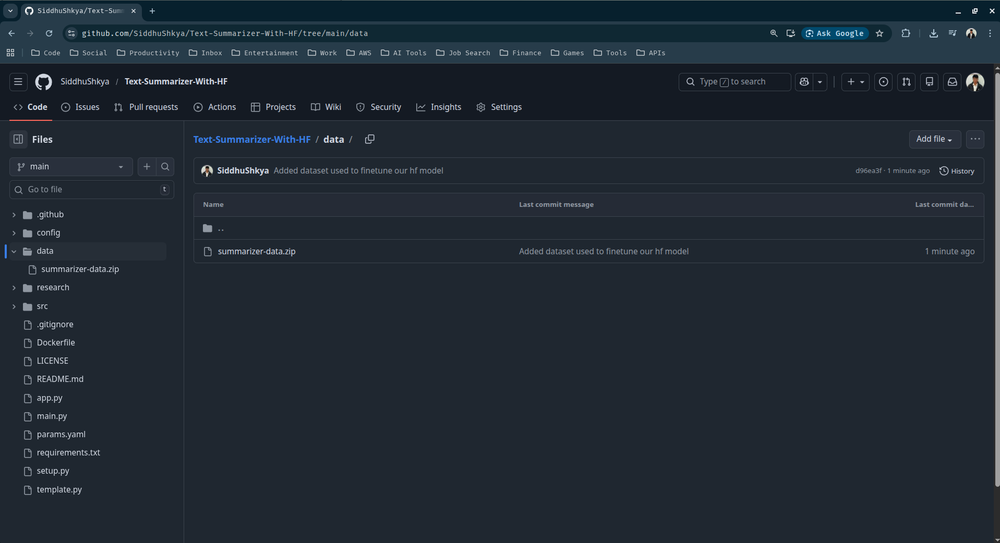

### 3. Finetuning Huggingface Models

In this section, we are going to finetune a huggingface model using a dataset with the help of jupyter notebook.

3.1 Create the new jupyter notebook file (text-summarizer.ipynb) inside our research folder 

```text
.
├── app.py
├── config
├── Dockerfile
├── .git
├── .github
├── .gitignore
├── LICENSE
├── logs
├── main.py
├── params.yaml
├── README.md
├── requirements.txt
├── research
│   └── research-notebook.ipynb
│   └── text-summarizer.ipynb   <-------- # Your new jupyter notebook file
├── setup.py
├── src
├── template.py
└── venv
```

> For our project we are going to use the below model for summarization and dataset for finetuning

- Model -> [google/flan-t5-small](https://huggingface.co/google/flan-t5-small)
- Dataset -> [knkarthick/samsum](https://huggingface.co/datasets/knkarthick/samsum)

> *Note that we can also use the google colab notebook for this finetuning process as it has more GPU RAM (15 GB) compared to my local machines (3.6 GB).*

3.2 Copy, paste and run the below codes from cell to cell to your jupyter notebook file (text-summarizer.ipynb)

> Check for Nvidia Driver 
```python
## Cell 1

!nvidia-smi
```
```
Sat Jan 31 06:34:39 2026       
+-----------------------------------------------------------------------------------------+
| NVIDIA-SMI 580.95.05              Driver Version: 580.95.05      CUDA Version: 13.0     |
+-----------------------------------------+------------------------+----------------------+
| GPU  Name                 Persistence-M | Bus-Id          Disp.A | Volatile Uncorr. ECC |
| Fan  Temp   Perf          Pwr:Usage/Cap |           Memory-Usage | GPU-Util  Compute M. |
|                                         |                        |               MIG M. |
|=========================================+========================+======================|
|   0  NVIDIA GeForce GTX 1650        Off |   00000000:01:00.0  On |                  N/A |
| N/A   30C    P8              3W /   50W |      45MiB /   4096MiB |     24%      Default |
|                                         |                        |                  N/A |
+-----------------------------------------+------------------------+----------------------+

+-----------------------------------------------------------------------------------------+
| Processes:                                                                              |
|  GPU   GI   CI              PID   Type   Process name                        GPU Memory |
|        ID   ID                                                               Usage      |
|=========================================================================================|
|    0   N/A  N/A            3783      G   /usr/lib/xorg/Xorg                       39MiB |
+-----------------------------------------------------------------------------------------+
```


> Install some dependencies if not already

```python
## Cell 2 (Optional)

!pip install transformers[sentencepiece] datasets sacrebleu rouge_score py7zr -q
```

> Update the accelerate 

```python
## Cell 3 (Optional)

!pip install --upgrade accelerate
!pip uninstall -y transformers accelerate
!pip install transformers accelerate
```

*`Purpose of accelerate :` A library by Hugging Face is designed to simplify the process of running PyTorch models on any type of hardware setup—whether it's a single CPU, a single GPU, or multiple GPUs (Multi-GPU/TPU) across several nodes.*


> Import the necessary dependencies

```python
## Cell 4

import os
import zipfile
import evaluate
import torch
import pandas as pd
import urllib.request
from datasets import Dataset
from transformers import pipeline
from transformers import DataCollatorForSeq2Seq
from transformers import TrainingArguments, Trainer
from transformers import AutoModelForSeq2SeqLM, AutoTokenizer

import nltk
nltk.download('punkt')
```

> Lets also now download our [dataset](https://huggingface.co/datasets/knkarthick/samsum/tree/main), and upload it to our github repo as a zip file (summarizer-data.zip). The zip will have the below downloaded .csv files:

```text
train.csv
validation.csv
test.csv
```

> Create a new folder inside our project directory and move the summarizer-data.zip to it

```text
.
├── app.py
├── config
├── data
│   └── summarizer-data.zip  # <-------- Your dataset here
├── Dockerfile
├── .git
├── .github
├── .gitignore
├── LICENSE
├── logs
├── main.py
├── params.yaml
├── README.md
├── requirements.txt
├── research
├── setup.py
├── src
├── template.py
└── venv
```

> Add, commit and push the data to our githup repo

```sh
siddhu@ubuntu:~/Desktop/Text-Summarizer-With-HF$ git add data/
siddhu@ubuntu:~/Desktop/Text-Summarizer-With-HF$ git commit -m 'Added dataset used to fine
tune our hf model'
siddhu@ubuntu:~/Desktop/Text-Summarizer-With-HF$ git push origin main
```

> Verify the push from the github repo page



✅ Now that the data has been successfully uploaded, lets jump back to coding

> Check whether we are going to use GPU or not

```python
## Cell 5

device = (
    "cuda" if torch.cuda.is_available() else "cpu"
)  # Choose GPU if available, else CPU
print("Device : ", device)  # Print the selected device
```
```text
Device :  cuda
```

> Load our model & tokenizer

```python
## Cell 6

MODEL_NAME = "google/flan-t5-small"  # Specify the pre-trained model name

tokenizer = AutoTokenizer.from_pretrained(MODEL_NAME)  # Load tokenizer for the model
model = AutoModelForSeq2SeqLM.from_pretrained(MODEL_NAME).to(
    device
)  # Load model and move to device
print(f"Model loaded successfully on {device}")  # Confirm model is loaded
```
```text
Model loaded successfully on cuda
```
> Basic Functionality of HuggingFace Model (Optional)

```python
## Cell 7

article = """
The stock market saw a significant dip on Monday as investors reacted to new inflation data. 
Tech stocks were the hardest hit, with major indices dropping by over 2%. Analysts suggest 
that while the volatility is concerning, long-term projections remain stable if interest 
rates hold steady.
"""  # Sample article to summarize

input_text = "summarize: " + article  # Add prefix to indicate summarization task
input_ids = tokenizer(input_text, return_tensors="pt").input_ids.to(
    device
)  # Tokenize and move to device

outputs = model.generate(
    input_ids,
    max_length=50,  # Maximum length of generated summary
    min_length=15,  # Minimum length of generated summary
    num_beams=4,  # Beam search for better quality
    no_repeat_ngram_size=3,  # Prevent repeating trigrams
    repetition_penalty=2.5,  # Penalize repetition
    length_penalty=1.0,  # Control length preference
    early_stopping=True,  # Stop when all beams finish
)

print(
    tokenizer.decode(outputs[0], skip_special_tokens=True)
)  # Decode and print summary
```
```text
Stock markets saw a significant dip on Monday as investors reacted to new inflation data.
```

> Fine Tuning

- Define functions to download & extract our data from a url

```python
## Cell 8

def download_and_extract(url: str, zip_name: str = "summarizer-data.zip", extract_dir: str = "summarizer-data"):
    
    # Download
    if not os.path.exists(zip_name):
        print("Downloading dataset...")
        urllib.request.urlretrieve(url, zip_name)
    else:
        print("Zip file already exists. Skipping download.")
    
    # Extract
    if not os.path.exists(extract_dir):
        os.makedirs(extract_dir)

    with zipfile.ZipFile(zip_name, "r") as zip_ref:
        # Get top-level folder(s) in zip
        top_level_dirs = set(f.split("/")[0] for f in zip_ref.namelist() if f.strip())
        # Check if top-level folder(s) exist already
        already_extracted = all(os.path.exists(os.path.join(extract_dir, d)) for d in top_level_dirs)
        if already_extracted:
            print("Dataset already extracted. Skipping unzip.")
        else:
            print("Extracting dataset...")
            # Flatten: remove the top-level folder from the zip paths
            for f in zip_ref.namelist():
                if f.strip():  # skip empty entries
                    path_parts = f.split("/")
                    # Skip the first folder in path
                    target_path = os.path.join(extract_dir, *path_parts[1:])
                    if f.endswith("/"):
                        os.makedirs(target_path, exist_ok=True)
                    else:
                        os.makedirs(os.path.dirname(target_path), exist_ok=True)
                        with open(target_path, "wb") as out_file:
                            out_file.write(zip_ref.read(f))
            print("Extraction complete.")
```

- Download & extract our data

```python
## Cell 9

download_and_extract(
    url="https://github.com/SiddhuShkya/Text-Summarizer-With-HF/raw/main/data/summarizer-data.zip"
) 
```

> Verify if the data has been downloaded and extracted successfully or not

```sh
siddhu@ubuntu:~/Desktop/Text-Summarizer-With-HF/research$ tree -a -L 3
.
├── research-notebook.ipynb
├── summarizer-data        <---------- # Extracted zip folder
│   ├── test.csv
│   ├── train.csv
│   └── validation.csv
├── summarizer-data.zip    <---------- # Downlaoded zip file
└── text-summarizer.ipynb
```

Once the data has been successfully loaded, you can follow the below coding steps :

> Load our data into our text-summarizer.ipynb notebook as pandas dataframe

```python
## Cell 10

train_df = pd.read_csv("./summarizer-data/train.csv")  # Load training dataset
test_df = pd.read_csv("./summarizer-data/test.csv")  # Load test dataset
val_df = pd.read_csv("./summarizer-data/validation.csv")  # Load validation dataset

print(
    "Features in the dataset: ", train_df.columns.tolist()
)  # Print dataset column names
print("=" * 70)
print("Number of samples in each dataset:")
print("Train data samples: ", len(train_df))  # Print number of training samples
print("Test data samples: ", len(test_df))  # Print number of test samples
print("Validation data samples: ", len(val_df))  # Print number of validation samples
```
```text
Features in the dataset:  ['id', 'dialogue', 'summary']
======================================================================
Number of samples in each dataset:
Train data samples:  14731
Test data samples:  819
Validation data samples:  818
```

> Display one record

```python
## Cell 11

print(train_df["dialogue"][0])  # Print first dialogue/sample from training data
print(
    "\nSummary: ", train_df["summary"][0]
)  #
```
```text
Amanda: I baked  cookies. Do you want some?
Jerry: Sure!
Amanda: I'll bring you tomorrow :-)

Summary:  Amanda baked cookies and will bring Jerry some tomorrow.
```

> Tokenize & Prepare Data For Training Seq To Seq Model

- Python function to prepare our raw data for model training

```python
## Cell 12

def convert_examples_to_features(example_batch):
    model_inputs = tokenizer(
        example_batch["dialogue"],  # Tokenize input dialogue
        text_target=example_batch["summary"],  # Tokenize target summary for seq2seq
        max_length=1024,  # Max length for input tokens
        truncation=True,  # Truncate if longer than max_length
    )
    labels = tokenizer(
        text_target=example_batch["summary"],
        max_length=128,
        truncation=True,  # Tokenize summary as labels
    )
    model_inputs["labels"] = labels["input_ids"]  # Add tokenized labels to model inputs
    return model_inputs
```

- To use the above function with our dataframe, we need to first convert it to a dataset using the below codes:

```python
## Cell 13

# Convert dataframes → Dataset
train_dataset = Dataset.from_pandas(train_df)
test_dataset = Dataset.from_pandas(test_df)
val_dataset = Dataset.from_pandas(val_df)
# Apply the function with .map()
train_dataset = train_dataset.map(convert_examples_to_features, batched=True)
test_dataset = test_dataset.map(convert_examples_to_features, batched=True)
val_dataset = val_dataset.map(convert_examples_to_features, batched=True)
```

- Check your new dataset

```python
## Cell 14

print("Train Dataset:\n", train_dataset)  # Display tokenized training dataset
print("Test Dataset:\n", test_dataset)  # Display tokenized test dataset
print("Val Dataset:\n", val_dataset)  # Display tokenized validation dataset
```
```text
Train Dataset:
 Dataset({
    features: ['id', 'dialogue', 'summary', 'input_ids', 'attention_mask', 'labels'],
    num_rows: 14731
})
Test Dataset:
 Dataset({
    features: ['id', 'dialogue', 'summary', 'input_ids', 'attention_mask', 'labels'],
    num_rows: 819
})
Val Dataset:
 Dataset({
    features: ['id', 'dialogue', 'summary', 'input_ids', 'attention_mask', 'labels'],
    num_rows: 818
})
```

*Data Before Preparation:*

```python
{
    'id': '13862856',
    'dialogue': "Hannah: Hey, do you have Betty's number?\nAmanda: Lemme check\nHannah: <file_gif>\nAmanda: Sorry, can't find it.",
    'summary': "Hannah needs Betty's number but Amanda doesn't have it."
}
```

*Data After Preparation:*

```python
{
    'id': '13862856',
    'dialogue': "Hannah: Hey, do you have Betty's number?\nAmanda: Lemme check\nHannah: <file_gif>\nAmanda: Sorry, can't find it.",
    'summary': "Hannah needs Betty's number but Amanda doesn't have it."
    'input_ids': [123, 456, 789, .....] # Token IDs for the dialogue
    'attention_mask': [1, 1, 1, .....]  # Attention mask for the input
    'labels': [321, 654, 987, .....]    # Token Ids for the summary (target)
}
```

> Training Our Model

- Since, we are using a seq2seq model, we need to use `DataCollatorForSeq2Seq`, to make sure that our data is converted into batches before providing it for model training.

```python
## Cell 15

data_collator = DataCollatorForSeq2Seq(
    tokenizer=tokenizer,  # Tokenizer to dynamically pad inputs
    model=model,  # Model to handle special tokens for seq2seq
)
```

- Define our training arguments with the help of TrainingArguments()

```python
## Cell 16

training_args = TrainingArguments(
    output_dir="flan-t5-small-finetuned",  # Directory to save model checkpoints
    num_train_epochs=1,  # Number of training epochs
    warmup_steps=500,  # Steps for learning rate warmup
    per_device_train_batch_size=1,  # Batch size per device during training
    per_device_eval_batch_size=1,  # Batch size per device during evaluation
    weight_decay=0.01,  # L2 regularization
    logging_steps=10,  # Log training metrics every 10 steps
    eval_strategy="steps",  # Evaluate model at specified steps
    eval_steps=500,  # Evaluation interval in steps
    save_steps=100000,  # Save checkpoint every 100k steps
    gradient_accumulation_steps=16,  # Accumulate gradients over multiple steps
)
```

- Defining our trainer with the help of Trainer()

```python
## Cell 17

trainer = Trainer(
    model=model,  # Model to train
    args=training_args,  # Training arguments
    train_dataset=test_dataset,  # Dataset used for training (here using test dataset)
    eval_dataset=val_dataset,  # Dataset used for evaluation
    data_collator=data_collator,  # Collate batches dynamically
    processing_class=tokenizer,  # Tokenizer for preprocessing inputs
)
```

- Train the model

```python
## Cell 18

trainer.train()
```
```sh
TrainOutput(
    global_step=52, 
    training_loss=2.9682579774122972, 
    metrics={
        'train_runtime': 288.3112, 
        'train_samples_per_second': 2.841, 
        'train_steps_per_second': 0.18, 
        'total_flos': 313176745058304.0, 
        'train_loss': 2.9682579774122972, 
        'epoch': 1.0
    }
)
```

> Evaluate our model

```python
## Cell 19

# Move model to evaluation mode
model.eval()               # Set model to evaluation mode (disable dropout, etc.)
model.to(device)           # Move model to the selected device (CPU/GPU)
```

- Test the fine-tuned model by generating a summary

```python
## Cell 20

# Test text 
test_text = """summarize: The quick brown fox jumps over the lazy dog. 
            The dog was so lazy that it didn't even bark at the fox. 
            This event was caught on camera by a local hiker."""

inputs = tokenizer(
    test_text,
    return_tensors="pt",  # Return PyTorch tensors
    truncation=True,  # Truncate if text exceeds max_length
    padding="max_length",  # Pad to max_length
    max_length=512,  # Maximum input length
).to(device)

# Generate Summary
with torch.no_grad():  # Disable gradient calculation for inference
    outputs = model.generate(
        inputs["input_ids"],  # Input token IDs
        max_length=50,  # Maximum summary length
        num_beams=4,  # Beam search for better quality
        early_stopping=True,  # Stop generation when beam search is complete
    )

print("Summary:", tokenizer.decode(outputs[0], skip_special_tokens=True))
```
```text
Summary: The dog was so lazy that it didn't even bark at the fox.
```

- We are going to use `ROUGE` evaluation for our model, because it is the standard automatic metric for summarization.

```python
## Cell 21

rouge_metric = evaluate.load("rouge")
rouge_names = ["rouge1", "rouge2", "rougeL", "rougeLsum"]
```

- Defining a batch generator function that splits a specified dataset column to process data in batches.

```python
## Cell 22

def generate_batch_sized_chunks(list_of_elements, batch_size):
    """Split a list into smaller batches of given size"""
    for i in range(0, len(list_of_elements), batch_size):
        yield list_of_elements[i : i + batch_size]  # Yield each batch
```

- Defining the function that computes the ROUGE scores for a dataset by generating summaries and comparing them to the reference summaries.

```python
## Cell 23

def calculate_metric_on_test_ds(
    dataset,
    metric,
    model,
    tokenizer,
    batch_size=1,
    device=device,
    column_text="article",
    column_summary="highlights",
):
    model.eval()  # Set model to evaluation mode

    # Split dataset into batches
    article_batches = list(
        generate_batch_sized_chunks(dataset[column_text], batch_size)
    )
    target_batches = list(
        generate_batch_sized_chunks(dataset[column_summary], batch_size)
    )

    with torch.no_grad():  # Disable gradient calculation
        for article_batch, target_batch in zip(article_batches, target_batches):
            inputs = tokenizer(
                article_batch,
                max_length=256,  # Max input length
                truncation=True,  # Truncate if too long
                padding="max_length",  # Pad to max length
                return_tensors="pt",  # Return PyTorch tensors
            )

            summaries = model.generate(
                input_ids=inputs["input_ids"].to(device),  # Move inputs to device
                attention_mask=inputs["attention_mask"].to(device),
                max_new_tokens=128,  # Max tokens for output
                num_beams=1,  # Beam search width
                do_sample=False,  # Deterministic generation
                use_cache=True,  # Use past key values for speed
            )

            decoded_summaries = tokenizer.batch_decode(
                summaries,
                skip_special_tokens=True,  # Decode outputs to text
            )

            metric.add_batch(
                predictions=decoded_summaries,  # Add generated summaries
                references=target_batch,  # Add reference summaries
            )

    return metric.compute()  # Compute final metric (e.g., ROUGE, BLEU)
```

- Evaluate our model on the valisdation set using the ROUGE metric.
```python
## Cell 24

score = calculate_metric_on_test_ds(
    dataset=test_dataset[0:50],  # Evaluate on first 50 samples of test dataset
    metric=rouge_metric,  # Use the loaded ROUGE metric
    model=trainer.model,  # Model to generate summaries
    tokenizer=tokenizer,  # Tokenizer for preprocessing
    column_text="dialogue",  # Column containing input text
    column_summary="summary",  # Column containing reference summaries
)

# Extract only the specified ROUGE scores
rouge_dict = {name: score[name] for name in rouge_names}

# Convert to DataFrame for display
pd.DataFrame(rouge_dict, index=["flan-t5-small-finetuned"])
```
<div>
<table border="1" class="dataframe">
  <thead>
    <tr style="text-align: right;">
      <th></th>
      <th>rouge1</th>
      <th>rouge2</th>
      <th>rougeL</th>
      <th>rougeLsum</th>
    </tr>
  </thead>
  <tbody>
    <tr>
      <th>flan-t5-small-finetuned</th>
      <td>0.364824</td>
      <td>0.116339</td>
      <td>0.286061</td>
      <td>0.286229</td>
    </tr>
  </tbody>
</table>
</div>

*We are getting values less than 0.5 because, we have trained our model for 1 epoch only*

📌 **Important Note**

1. `Scores close to 1:` Indicates a strong overlap between the generated summary and the reference summary, which is desirable in summarization tasks.

2. `Scores between 0.5  and 0.7:` Indicates moderate overlap. The summary might be capturing the key points but is likely missing some structure or important information.

3. `Scores below 0.5:` Suggests a poor match between the generated and reference summaries. The model might be generating irrelevant or incomplete summaries that dont capture the ky ideas well.

---

> Save the model & tokenizer

```python
## Cell 25

model.save_pretrained("t5-model")  # Save the fine-tuned model to disk
tokenizer.save_pretrained("t5-tokenizer")  # Save the tokenizer to disk
```
```sh
('t5-tokenizer/tokenizer_config.json',
 't5-tokenizer/special_tokens_map.json',
 't5-tokenizer/spiece.model',
 't5-tokenizer/added_tokens.json',
 't5-tokenizer/tokenizer.json')
```

> Verify if the model and tokenizer have been saved or not

```sh
siddhu@ubuntu:~/Desktop/Text-Summarizer-With-HF$ cd research/
siddhu@ubuntu:~/Desktop/Text-Summarizer-With-HF/research$ tree -a -L 3
.
├── flan-t5-small-finetuned
├── t5-model  <---------------- ## Saved Model
│   ├── config.json
│   ├── generation_config.json
│   └── model.safetensors
├── t5-tokenizer  <------------ ## Saved Tokenizer
│   ├── special_tokens_map.json
│   ├── spiece.model
│   ├── tokenizer_config.json
│   └── tokenizer.json
├── research-notebook.ipynb
├── summarizer-data
│   ├── test.csv
│   ├── train.csv
│   └── validation.csv
├── summarizer-data.zip
└── text_summarizer.ipynb
```

> Load the model & tokenizer

- Define the path to our saved model and tokenizer
```python
## Cell 26

model_path = "./t5-model"  # Path to the saved fine-tuned model
tokenizer_path = "./t5-tokenizer"  # Path to the saved tokenizer

tokenizer = AutoTokenizer.from_pretrained(tokenizer_path)  # Load the saved tokenizer
model = AutoModelForSeq2SeqLM.from_pretrained(model_path)  # Load the saved model
```

- Define our generation configuration

```python
## Cell 27

gen_kwargs = {
    "max_length": 20,  # Maximum length of generated text
    "min_length": 5,  # Minimum length of generated text
    "length_penalty": 2.0,  # Penalize shorter sequences
    "num_beams": 4,  # Beam search width for better quality
}
```

- Create a Summarization Pipeline using our saved model and tokenizer

```python
## Cell 28

pipe = pipeline(
    "summarization",  # Use pipeline for text summarization
    model=model,  # Use the loaded/fine-tuned model
    tokenizer=tokenizer,  # Use the corresponding tokenizer
)
```

- Use the pipeline to generate a summary on a sample dialogue

```python
## Cell 29

sample_text = train_dataset[0]["dialogue"]  # Take first dialogue from training dataset
reference = train_dataset[0]["summary"]  # Take corresponding reference summary

print("Dialogue : \n", sample_text)  # Print the input dialogue
print("\nReference Summary : \n", reference)  # Print the reference summary
print(
    "\nModel Summary : \n", pipe(sample_text, **gen_kwargs)[0]["summary_text"]
)  # Generate and print model summary
```
```text
Dialogue : 
 Amanda: I baked  cookies. Do you want some?
Jerry: Sure!
Amanda: I'll bring you tomorrow :-)

Reference Summary : 
 Amanda baked cookies and will bring Jerry some tomorrow.

Model Summary : 
 Amanda baked cookies. Jerry will bring Amanda tomorrow.
```

- You can also generate summary using the below code

```python
## Cell 30

# 1. Grab your text from the dataset
sample_text = train_dataset[0]["dialogue"]  # Input dialogue from dataset
reference = train_dataset[0]["summary"]  # Reference summary for comparison

# 2. Tokenize the input dialogue
# truncation=True ensures it fits within the model's 1024 token limit
inputs = tokenizer(
    sample_text, truncation=True, padding="longest", return_tensors="pt"
).to(device)

# 3. Generate the summary
# Model outputs token IDs for the summary
summary_ids = model.generate(
    inputs["input_ids"],
    max_length=128,  # Maximum tokens for generated summary
    num_beams=4,  # Beam search width for better quality
    length_penalty=2.0,  # Favor longer sequences
    early_stopping=True,  # Stop generation when beams finish
)

# 4. Decode the IDs back into a string
decoded_summary = tokenizer.decode(summary_ids[0], skip_special_tokens=True)

# 5. Compare the results
print("--- DIALOGUE ---")
print(sample_text)  # Print original dialogue
print("\n--- REFERENCE SUMMARY (Ground Truth) ---")
print(reference)  # Print reference summary
print("\n--- MODEL GENERATED SUMMARY ---")
print(decoded_summary)  # Print model-generated summary
```
```text
--- DIALOGUE ---
Amanda: I baked  cookies. Do you want some?
Jerry: Sure!
Amanda: I'll bring you tomorrow :-)

--- REFERENCE SUMMARY (Ground Truth) ---
Amanda baked cookies and will bring Jerry some tomorrow.

--- MODEL GENERATED SUMMARY ---
Amanda baked cookies. Jerry will bring Amanda tomorrow.
```

> Now that our model has been trained as well as saved, lets commit our current changes to our github repository

- Before commiting, add the below files and folders to .gitignore file

```text
## .gitignore

/venv
/artifacts
/logs

# Ignore Jupyter Notebook checkpoints
.ipynb_checkpoints/
# Ignore Python cache files
__pycache__/
*.pyc

summarizer-data.zip
research/flan-t5-small-finetuned/
research/t5-model/
research/t5-tokenizer/
research/summarizer-data/
```

- Commit the changes to our github repo

```sh
siddhu@ubuntu:~/Desktop/Text-Summarizer-With-HF/research$ git add .
siddhu@ubuntu:~/Desktop/Text-Summarizer-With-HF/research$ git commit -m 'Finetuned HF Model'
siddhu@ubuntu:~/Desktop/Text-Summarizer-With-HF/research$ git push origin main
```

---
