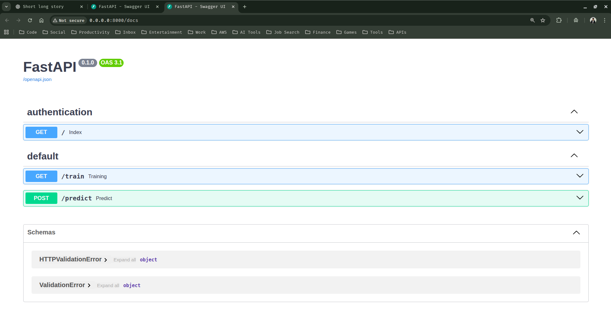

### 5. Prediction Pipeline and API Integration

In this section we are going to create our entire prediction pipeline, along with our frontend and API implementation using FastAPI.

5.1 Create a new python file (prediction_pipeline) inside the pipeline folder and copy paste the below code to it

```python
## src/textSummarizer/pipeline/prediction_pipeline.py

from transformers import pipeline
from transformers import AutoTokenizer, AutoModelForSeq2SeqLM
from src.textSummarizer.config.configuration import ConfigurationManager
from src.textSummarizer.logging import logger


class PredictionPipeline:
    def __init__(self):
        self.config = ConfigurationManager().get_model_evaluation_config()

    def predict(self, text: str) -> str:
        try:
            tokenizer = AutoTokenizer.from_pretrained(self.config.tokenizer_path)
            model = AutoModelForSeq2SeqLM.from_pretrained(self.config.model_path)
            gen_kwargs = {
                "max_length": 20,
                "min_length": 5,
                "length_penalty": 2.0,
                "num_beams": 4,
            }
            pipe = pipeline("summarization", model=model, tokenizer=tokenizer)
            output = pipe(text, **gen_kwargs)[0]["summary_text"]
            print(f"Summarized Text: {output}")
            return output
        except Exception as e:
            logger.exception(e)
            raise e
```

5.2 Create our text summarization app using FastAPI and app.py. 

- Copy paste the below code to our app.py file

```python
## main.py

import os
import uvicorn
from fastapi import FastAPI
from starlette.responses import RedirectResponse
from fastapi import Response
from src.textSummarizer.pipeline.prediction_pipeline import PredictionPipeline


text: str = "What is text summarization ?"

app = FastAPI()

@app.get("/", tags=["authentication"])
async def index():
    return RedirectResponse(url="/docs")

@app.get("/train")
async def training():
    try:
        os.system("python main.py")
        return Response("Training Successful !!")
    except Exception as e:
        return Response(f"Error Occurred! {e}")

@app.post("/predict")
async def predict(text):
    try:
        pipeline = PredictionPipeline()
        summarized_text = pipeline.predict(text)
        return Response(f"Summarized Text: {summarized_text}")
    except Exception as e:
        return Response(f"Error Occurred! {e}")


if __name__ == "__main__":
    uvicorn.run(app, host="0.0.0.0", port=8000)
```

- Run the app

```python 
python app.py
```
```sh
INFO:     Started server process [90065]
[2026-02-01 12:08:02,215: INFO: server: Started server process [90065]]
INFO:     Waiting for application startup.
[2026-02-01 12:08:02,215: INFO: on: Waiting for application startup.]
INFO:     Application startup complete.
[2026-02-01 12:08:02,216: INFO: on: Application startup complete.]
INFO:     Uvicorn running on http://0.0.0.0:8000 (Press CTRL+C to quit)
[2026-02-01 12:08:02,216: INFO: server: Uvicorn running on http://0.0.0.0:8000 (Press CTRL+C to quit)]
INFO:     127.0.0.1:47156 - "GET / HTTP/1.1" 307 Temporary Redirect
INFO:     127.0.0.1:47156 - "GET /docs HTTP/1.1" 200 OK
INFO:     127.0.0.1:47156 - "GET /openapi.json HTTP/1.1" 200 OK
```

- Access your web app

```text
http://0.0.0.0:8000/docs
```

- You should see your web app, similar to the below one



> Endpoints 

- `/` Root Endpoint -> It redirects to the API documentation page (/docs), which helps to quickly test our API endpoints using Swagger UI.

- `/train` Training endpoint -> Trains our text summarization model from scratch or fine-tunes it using main.py

- `/predict` Prediction / Summarization endpoint -> To summarize text using our trained model.

5.3 You can use the predict endpoint to summarize a given text.

> Try out, the predict endpoint and copy paste the below text

```text
Every night, the lighthouse shone for ships that never came.
One morning, the keeper realized the light had guided him through the dark instead.
```

> You should be able to see the below output from one of the responses.

```yaml
Summarized Text: Eventually, the keeper realized the light had guided him through the dark.
```

---

# <div align="center">Thank You for Going Through This Guide! 🙏✨</div>
