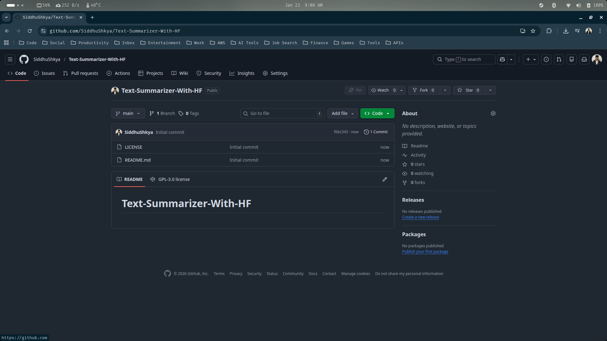
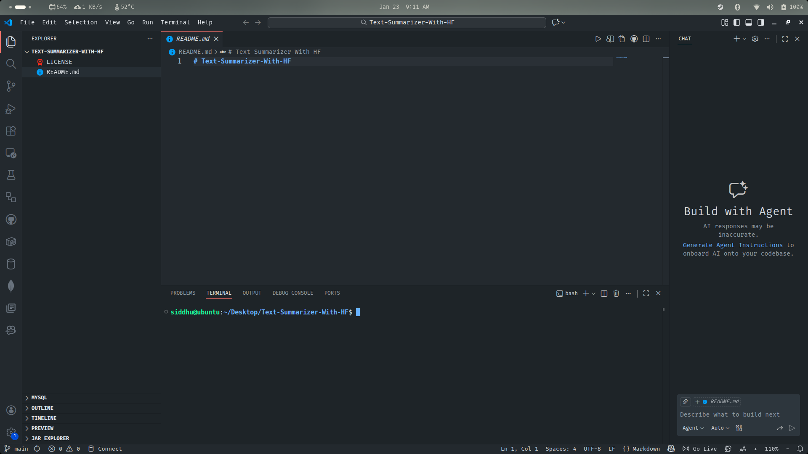
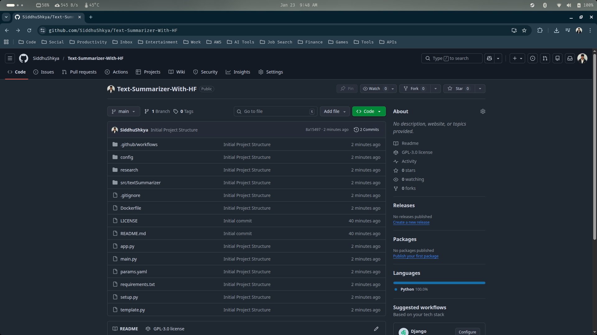

## Text Summarization : An NLP Project With Huggingface 


In this project, we are going to implement a text summarization using the various open-source models that are provided by huggingface. We will also be fine tuning the models for summarization

---

### 1. Project Structure & GitHub Repo Setup

In this section, we are going start our project implementation. We are going to set up our project github repository and create an initial project structure suitable for the project.

1.1 Firstly, let's create an github repositorty with the project name 'Text-Summarizer-With-HF'



> Also clone the newly created project repo into our local machine, from withing the colned repo open up your vs-code

```sh
siddhu@ubuntu:~/Desktop$ git clone git@github.com:SiddhuShkya/Text-Summarizer-With-HF.git
Cloning into 'Text-Summarizer-With-HF'...
remote: Enumerating objects: 4, done.
remote: Counting objects: 100% (4/4), done.
remote: Compressing objects: 100% (3/3), done.
remote: Total 4 (delta 0), reused 0 (delta 0), pack-reused 0 (from 0)
Receiving objects: 100% (4/4), 12.75 KiB | 12.75 MiB/s, done.
siddhu@ubuntu:~/Desktop$ cd Text-Summarizer-With-HF/
siddhu@ubuntu:~/Desktop/Text-Summarizer-With-HF$ code .
```



1.2 Create and activate an environment for this project using the below commands

```sh
siddhu@ubuntu:~/Desktop/Text-Summarizer-With-HF$ conda create -p venv python==3.10
siddhu@ubuntu:~/Desktop/Text-Summarizer-With-HF$ conda activate venv/
```

1.3 Create 2 new files requirements.txt and template.py, and copy paste the below dependences and python script to them respectively.

> Copy paste the below to the requirements.txt file

```text
## requirements.txt

ipykernel
fastapi
transformers>=4.26.0,<5.0.0
transformers[sentencepiece]
datasets
sacrebleu
rouge_score
py7zr
pandas
nltk
tqdm
PyYAML
matplotlib
torch
evaluate
boto3
mypy-boto3-s3
accelerate>=1.1.0
python-box==6.0.2
ensure==1.0.2
uvicorn==0.18.3
Jinja2==3.1.2
notebook
jupyter>=1.0.0
ipywidgets>=8.0.0
```

> Install the dependencies to your conda environment, using the requirements.txt file

```sh
(/home/siddhu/Desktop/Text-Summarizer-With-HF/venv) siddhu@ubuntu:~/Desktop/Text-Summarizer-With-HF$ pip install -r requirements.txt 
```

> While the installion is being done, lets also complete our template.py, copy paste the below script to template.py

```python
## template.py

import os
import logging
from pathlib import Path

logging.basicConfig(level=logging.INFO, format="[%(asctime)s]: %(message)s:")

project_name = "textSummarizer"

list_of_files = [
    ".github/workflows/.gitkeep",
    f"src/{project_name}/__init__.py",
    f"src/{project_name}/components/__init__.py",
    f"src/{project_name}/utils/__init__.py",
    f"src/{project_name}/config/__init__.py",
    f"src/{project_name}/config/configuration.py",
    f"src/{project_name}/pipeline/__init__.py",
    f"src/{project_name}/entity/__init__.py",
    f"src/{project_name}/utils/common.py",
    f"src/{project_name}/logging/__init__.py",
    f"src/{project_name}/constants/__init__.py",
    "params.yaml",
    "config/config.yaml",
    ".gitignore",
    "app.py",
    "main.py",
    "requirements.txt",
    "Dockerfile",
    "setup.py",
    "research/research-notebook.ipynb",
]

for filepath in list_of_files:
    filepath = Path(filepath)
    filedir, filename = os.path.split(filepath)

    if filedir != "":
        os.makedirs(filedir, exist_ok=True)
        logging.info(f"Creating directory: {filedir} for file: {filename}")

    if (not os.path.exists(filepath)) or (os.path.getsize(filepath) == 0):
        with open(filepath, "w") as f:
            pass
        logging.info(f"Creating empty file: {filepath}")
    else:
        logging.info(f"File already exists: {filepath}, skipping creation.")
```

> This file helps to create all required directories and empty files for our project in a consistent structure, instead of having to do it manually. This is especially useful in:

- MLOps projects
- Production-grade ML pipelines
- Team environments

1.4 Initiate our project structure using the template.py

```sh
(/home/siddhu/Desktop/Text-Summarizer-With-HF/venv) siddhu@ubuntu:~/Desktop/Text-Summarizer-With-HF$ python template.py 
```

> After, running the above command our project structure should look something like this:

```sh
.
├── app.py
├── config
│   └── config.yaml
├── Dockerfile
├── .gitignore
├── .git
├── .github
│   └── workflows
├── LICENSE
├── main.py
├── params.yaml
├── README.md
├── requirements.txt
├── research
│   └── research-notebook.ipynb
├── setup.py
├── src
│   └── textSummarizer
├── template.py
└── venv
```

1.5 Add the below two folders to .gitignore file as we dont have to track them 

```text
/venv
/artifacts
/logs

# Ignore Jupyter Notebook checkpoints
.ipynb_checkpoints/
# Ignore Python cache files
__pycache__/
*.pyc
```

1.6 Add, commit and push our changes to the main branch of our github repository

```sh
(/home/siddhu/Desktop/Text-Summarizer-With-HF/venv) siddhu@ubuntu:~/Desktop/Text-Summarizer-With-HF$ git add .
(/home/siddhu/Desktop/Text-Summarizer-With-HF/venv) siddhu@ubuntu:~/Desktop/Text-Summarizer-With-HF$ git commit -m 'Initial Project Structure'
(/home/siddhu/Desktop/Text-Summarizer-With-HF/venv) siddhu@ubuntu:~/Desktop/Text-Summarizer-With-HF$ git push origin main
```

> Verify the commit from the github repository page by reloading it



> The Project Structure setup for this project has been completed.

### 2. Logging & Utils Common Functionalities

In this section we are going to implement the common utility functions and logging setup required across the project. These components will help us:

- Track training progress
- Save model checkpoints
- Log evaluation metrics
- Handle reusable helper functions
- Improve reproducibility

2.1 Let's begin by implementing our basic logging functionalites. 

> For logging we will be using the file shown below 

```text
├── src
│   └── textSummarizer
│       ├── components
│       ├── config
│       ├── constants
│       ├── entity
│       ├── __init__.py
│       ├── logging
│       │   └── __init__.py <------------ # This file 
│       ├── pipeline
│       └── utils
```

> Copy paste the below python script to the above mentioned file

```python
## src/logging/__init__.py

import os
import sys
import logging

log_dir = "logs"
logging_str = "[%(asctime)s: %(levelname)s: %(module)s: %(message)s]"

log_file_path = os.path.join(log_dir, "text_summarizer.log")
os.makedirs(log_dir, exist_ok=True)

logging.basicConfig(
    level=logging.INFO,
    format=logging_str,
    handlers=[logging.FileHandler(log_file_path), logging.StreamHandler(sys.stdout)],
)

logger = logging.getLogger("summarizer_logger")
```

2.2 Verify if the logging has been implemented or not

> Copy paste the below python code to main.py

```python
## main.py

from src.textSummarizer.logging import logger

logger.info("Starting the text summarization process.")
logger.info("Text summarization process completed successfully.")
```
> Run the python main.py file, you should see output similar to the below one

```sh
siddhu@ubuntu:~/Desktop/Text-Summarizer-With-HF$ python main.py 
[2026-01-23 12:34:00,557: INFO: main: Starting the text summarization process.]
[2026-01-23 12:34:00,557: INFO: main: Text summarization process completed successfully.]
```

> In our case, its working fine

2.3 Now, let's go ahead and implement some of the common functionalities we will be using for the project

> For defining our common utilities/functions we will be using the file shown below 

```text
├── src
│   └── textSummarizer
│       ├── components
│       ├── config
│       ├── constants
│       ├── entity
│       └── utils
│       │    └── __init__.py  
│       │    └── common.py   <------------ # This file 
│       ├── __init__.py
│       ├── logging
│       ├── pipeline
```

> Copy paste the below python script to the above mentioned file

```python
## src/utils/common.py

import os
from box.exceptions import BoxValueError
import yaml
from src.textSummarizer.logging import logger
from ensure import ensure_annotations
from box import ConfigBox
from pathlib import Path
from typing import Any


@ensure_annotations
def read_yaml(path_to_yaml: Path) -> ConfigBox:
    """Reads a YAML file and returns its contents as a ConfigBox object.

    Args:
        path_to_yaml (Path): The path to the YAML file.

    Returns:
        ConfigBox: The contents of the YAML file as a ConfigBox object.
    """
    try:
        with open(path_to_yaml, "r") as yaml_file:
            content = yaml.safe_load(yaml_file)
            logger.info(f"YAML file '{path_to_yaml}' read successfully.")
            return ConfigBox(content)
    except BoxValueError as box_error:
        logger.error(
            f"BoxValueError while converting YAML content to ConfigBox: {box_error}"
        )
        raise box_error
    except Exception as e:
        logger.error(f"Error reading YAML file '{path_to_yaml}': {e}")
        raise e

@ensure_annotations
def create_directories(path_to_directories: list[Path]) -> None:
    """Creates directories if they do not exist.

    Args:
        path_to_directories (list[Path]): A list of directory paths to create.
    """
    for path in path_to_directories:
        try:
            os.makedirs(path, exist_ok=True)
            logger.info(f"Directory '{path}' created successfully or already exists.")
        except Exception as e:
            logger.error(f"Error creating directory '{path}': {e}")
            raise e
```

📌 **Important Notes**

- Why use ConfigBox ?

> Without ConfigBox:

```python
dict_info = {"name": "Siddhartha", "age": 22, "city": "Bhaktapur"}
print(dict_info["name"])
print(dict_info.name)
```
```sh
---------------------------------------------------------------------------
AttributeError                            Traceback (most recent call last)
Cell In[6], line 3
      1 dict_info = {"name": "Siddhartha", "age": 22, "city": "Bhaktapur"}
      2 print(dict_info["name"])
----> 3 print(dict_info.name)

AttributeError: 'dict' object has no attribute 'name'
```

> With ConfigBox:

```python
from box import ConfigBox

dict_info = ConfigBox({"name": "Siddhartha", "age": 22, "city": "Bhaktapur"})
print(dict_info['name'])
print(dict_info.name)
```

```sh
Siddhartha
Siddhartha
```

- Why @ensure_annotations?

> Without @ensure_annotations:

```python
def multiply(a :int, b :int) -> int:
    return a * b

result = multiply(3, "4")
print(result)
```
```sh
444
```

> With @ensure_annotations:

```python
from ensure import ensure_annotations

@ensure_annotations
def multiply(a: int, b: int) -> int:
    return a * b

result = multiply(3, "4")
print(result)
```
```sh
EnsureError: Argument b of type <class 'str'> to <function multiply at 0x7ddb4806a950> does not match annotation type <class 'int'>
```

Throws an Error, making sure that only the correct values are passed and returned.

---

### 3. Finetuning Huggingface Models

In this section, we are going to finetune a huggingface model using a dataset with the help of jupyter notebook.

3.1 Create the new jupyter notebook file (text-summarizer.ipynb) inside our research folder 

```text
.
├── app.py
├── config
├── Dockerfile
├── .git
├── .github
├── .gitignore
├── LICENSE
├── logs
├── main.py
├── params.yaml
├── README.md
├── requirements.txt
├── research
│   └── research-notebook.ipynb
│   └── text-summarizer.ipynb   <-------- # Your new jupyter notebook file
├── setup.py
├── src
├── template.py
└── venv
```

> For our project we are going to use the below model for summarization and dataset for finetuning

- Model -> [google/flan-t5-small](https://huggingface.co/google/flan-t5-small)
- Dataset -> [knkarthick/samsum](https://huggingface.co/datasets/knkarthick/samsum)

> *Note that we can also use the google colab notebook for this finetuning process as it has more GPU RAM (15 GB) compared to my local machines (3.6 GB).*

3.2 Copy, paste and run the below codes from cell to cell to your jupyter notebook file (text-summarizer.ipynb)

> Check for Nvidia Driver 
```python
## Cell 1

!nvidia-smi
```
```
Sat Jan 31 06:34:39 2026       
+-----------------------------------------------------------------------------------------+
| NVIDIA-SMI 580.95.05              Driver Version: 580.95.05      CUDA Version: 13.0     |
+-----------------------------------------+------------------------+----------------------+
| GPU  Name                 Persistence-M | Bus-Id          Disp.A | Volatile Uncorr. ECC |
| Fan  Temp   Perf          Pwr:Usage/Cap |           Memory-Usage | GPU-Util  Compute M. |
|                                         |                        |               MIG M. |
|=========================================+========================+======================|
|   0  NVIDIA GeForce GTX 1650        Off |   00000000:01:00.0  On |                  N/A |
| N/A   30C    P8              3W /   50W |      45MiB /   4096MiB |     24%      Default |
|                                         |                        |                  N/A |
+-----------------------------------------+------------------------+----------------------+

+-----------------------------------------------------------------------------------------+
| Processes:                                                                              |
|  GPU   GI   CI              PID   Type   Process name                        GPU Memory |
|        ID   ID                                                               Usage      |
|=========================================================================================|
|    0   N/A  N/A            3783      G   /usr/lib/xorg/Xorg                       39MiB |
+-----------------------------------------------------------------------------------------+
```


> Install some dependencies if not already

```python
## Cell 2 (Optional)

!pip install transformers[sentencepiece] datasets sacrebleu rouge_score py7zr -q
```

> Update the accelerate 

```python
## Cell 3 (Optional)

!pip install --upgrade accelerate
!pip uninstall -y transformers accelerate
!pip install transformers accelerate
```

*`Purpose of accelerate :` A library by Hugging Face is designed to simplify the process of running PyTorch models on any type of hardware setup—whether it's a single CPU, a single GPU, or multiple GPUs (Multi-GPU/TPU) across several nodes.*


> Import the necessary dependencies

```python
## Cell 4

import os
import zipfile
import evaluate
import torch
import pandas as pd
import urllib.request
from datasets import Dataset
from transformers import pipeline
from transformers import DataCollatorForSeq2Seq
from transformers import TrainingArguments, Trainer
from transformers import AutoModelForSeq2SeqLM, AutoTokenizer

import nltk
nltk.download('punkt')
```

> Lets also now download our [dataset](https://huggingface.co/datasets/knkarthick/samsum/tree/main), and upload it to our github repo as a zip file (summarizer-data.zip). The zip will have the below downloaded .csv files:

```text
train.csv
validation.csv
test.csv
```

> Create a new folder inside our project directory and move the summarizer-data.zip to it

```text
.
├── app.py
├── config
├── data
│   └── summarizer-data.zip  # <-------- Your dataset here
├── Dockerfile
├── .git
├── .github
├── .gitignore
├── LICENSE
├── logs
├── main.py
├── params.yaml
├── README.md
├── requirements.txt
├── research
├── setup.py
├── src
├── template.py
└── venv
```

> Add, commit and push the data to our githup repo

```sh
siddhu@ubuntu:~/Desktop/Text-Summarizer-With-HF$ git add data/
siddhu@ubuntu:~/Desktop/Text-Summarizer-With-HF$ git commit -m 'Added dataset used to fine
tune our hf model'
siddhu@ubuntu:~/Desktop/Text-Summarizer-With-HF$ git push origin main
```

> Verify the push from the github repo page


✅ Now that the data has been successfully uploaded, lets jump back to coding

> Check whether we are going to use GPU or not

```python
## Cell 5

device = (
    "cuda" if torch.cuda.is_available() else "cpu"
)  # Choose GPU if available, else CPU
print("Device : ", device)  # Print the selected device
```
```text
Device :  cuda
```

> Load our model & tokenizer

```python
## Cell 6

MODEL_NAME = "google/flan-t5-small"  # Specify the pre-trained model name

tokenizer = AutoTokenizer.from_pretrained(MODEL_NAME)  # Load tokenizer for the model
model = AutoModelForSeq2SeqLM.from_pretrained(MODEL_NAME).to(
    device
)  # Load model and move to device
print(f"Model loaded successfully on {device}")  # Confirm model is loaded
```
```text
Model loaded successfully on cuda
```
> Basic Functionality of HuggingFace Model (Optional)

```python
## Cell 7

article = """
The stock market saw a significant dip on Monday as investors reacted to new inflation data. 
Tech stocks were the hardest hit, with major indices dropping by over 2%. Analysts suggest 
that while the volatility is concerning, long-term projections remain stable if interest 
rates hold steady.
"""  # Sample article to summarize

input_text = "summarize: " + article  # Add prefix to indicate summarization task
input_ids = tokenizer(input_text, return_tensors="pt").input_ids.to(
    device
)  # Tokenize and move to device

outputs = model.generate(
    input_ids,
    max_length=50,  # Maximum length of generated summary
    min_length=15,  # Minimum length of generated summary
    num_beams=4,  # Beam search for better quality
    no_repeat_ngram_size=3,  # Prevent repeating trigrams
    repetition_penalty=2.5,  # Penalize repetition
    length_penalty=1.0,  # Control length preference
    early_stopping=True,  # Stop when all beams finish
)

print(
    tokenizer.decode(outputs[0], skip_special_tokens=True)
)  # Decode and print summary
```
```text
Stock markets saw a significant dip on Monday as investors reacted to new inflation data.
```

> Fine Tuning

- Define functions to download & extract our data from a url

```python
## Cell 8

def download_and_extract(url: str, zip_name: str = "summarizer-data.zip", extract_dir: str = "summarizer-data"):
    
    # Download
    if not os.path.exists(zip_name):
        print("Downloading dataset...")
        urllib.request.urlretrieve(url, zip_name)
    else:
        print("Zip file already exists. Skipping download.")
    
    # Extract
    if not os.path.exists(extract_dir):
        os.makedirs(extract_dir)

    with zipfile.ZipFile(zip_name, "r") as zip_ref:
        # Get top-level folder(s) in zip
        top_level_dirs = set(f.split("/")[0] for f in zip_ref.namelist() if f.strip())
        # Check if top-level folder(s) exist already
        already_extracted = all(os.path.exists(os.path.join(extract_dir, d)) for d in top_level_dirs)
        if already_extracted:
            print("Dataset already extracted. Skipping unzip.")
        else:
            print("Extracting dataset...")
            # Flatten: remove the top-level folder from the zip paths
            for f in zip_ref.namelist():
                if f.strip():  # skip empty entries
                    path_parts = f.split("/")
                    # Skip the first folder in path
                    target_path = os.path.join(extract_dir, *path_parts[1:])
                    if f.endswith("/"):
                        os.makedirs(target_path, exist_ok=True)
                    else:
                        os.makedirs(os.path.dirname(target_path), exist_ok=True)
                        with open(target_path, "wb") as out_file:
                            out_file.write(zip_ref.read(f))
            print("Extraction complete.")
```

- Download & extract our data

```python
## Cell 9

download_and_extract(
    url="https://github.com/SiddhuShkya/Text-Summarizer-With-HF/raw/main/data/summarizer-data.zip"
) 
```

> Verify if the data has been downloaded and extracted successfully or not

```sh
siddhu@ubuntu:~/Desktop/Text-Summarizer-With-HF/research$ tree -a -L 3
.
├── research-notebook.ipynb
├── summarizer-data        <---------- # Extracted zip folder
│   ├── test.csv
│   ├── train.csv
│   └── validation.csv
├── summarizer-data.zip    <---------- # Downlaoded zip file
└── text-summarizer.ipynb
```

Once the data has been successfully loaded, you can follow the below coding steps :

> Load our data into our text-summarizer.ipynb notebook as pandas dataframe

```python
## Cell 10

train_df = pd.read_csv("./summarizer-data/train.csv")  # Load training dataset
test_df = pd.read_csv("./summarizer-data/test.csv")  # Load test dataset
val_df = pd.read_csv("./summarizer-data/validation.csv")  # Load validation dataset

print(
    "Features in the dataset: ", train_df.columns.tolist()
)  # Print dataset column names
print("=" * 70)
print("Number of samples in each dataset:")
print("Train data samples: ", len(train_df))  # Print number of training samples
print("Test data samples: ", len(test_df))  # Print number of test samples
print("Validation data samples: ", len(val_df))  # Print number of validation samples
```
```text
Features in the dataset:  ['id', 'dialogue', 'summary']
======================================================================
Number of samples in each dataset:
Train data samples:  14731
Test data samples:  819
Validation data samples:  818
```

> Display one record

```python
## Cell 11

print(train_df["dialogue"][0])  # Print first dialogue/sample from training data
print(
    "\nSummary: ", train_df["summary"][0]
)  #
```
```text
Amanda: I baked  cookies. Do you want some?
Jerry: Sure!
Amanda: I'll bring you tomorrow :-)

Summary:  Amanda baked cookies and will bring Jerry some tomorrow.
```

> Tokenize & Prepare Data For Training Seq To Seq Model

- Python function to prepare our raw data for model training

```python
## Cell 12

def convert_examples_to_features(example_batch):
    model_inputs = tokenizer(
        example_batch["dialogue"],  # Tokenize input dialogue
        text_target=example_batch["summary"],  # Tokenize target summary for seq2seq
        max_length=1024,  # Max length for input tokens
        truncation=True,  # Truncate if longer than max_length
    )
    labels = tokenizer(
        text_target=example_batch["summary"],
        max_length=128,
        truncation=True,  # Tokenize summary as labels
    )
    model_inputs["labels"] = labels["input_ids"]  # Add tokenized labels to model inputs
    return model_inputs
```

- To use the above function with our dataframe, we need to first convert it to a dataset using the below codes:

```python
## Cell 13

# Convert dataframes → Dataset
train_dataset = Dataset.from_pandas(train_df)
test_dataset = Dataset.from_pandas(test_df)
val_dataset = Dataset.from_pandas(val_df)
# Apply the function with .map()
train_dataset = train_dataset.map(convert_examples_to_features, batched=True)
test_dataset = test_dataset.map(convert_examples_to_features, batched=True)
val_dataset = val_dataset.map(convert_examples_to_features, batched=True)
```

- Check your new dataset

```python
## Cell 14

print("Train Dataset:\n", train_dataset)  # Display tokenized training dataset
print("Test Dataset:\n", test_dataset)  # Display tokenized test dataset
print("Val Dataset:\n", val_dataset)  # Display tokenized validation dataset
```
```text
Train Dataset:
 Dataset({
    features: ['id', 'dialogue', 'summary', 'input_ids', 'attention_mask', 'labels'],
    num_rows: 14731
})
Test Dataset:
 Dataset({
    features: ['id', 'dialogue', 'summary', 'input_ids', 'attention_mask', 'labels'],
    num_rows: 819
})
Val Dataset:
 Dataset({
    features: ['id', 'dialogue', 'summary', 'input_ids', 'attention_mask', 'labels'],
    num_rows: 818
})
```

*Data Before Preparation:*

```python
{
    'id': '13862856',
    'dialogue': "Hannah: Hey, do you have Betty's number?\nAmanda: Lemme check\nHannah: <file_gif>\nAmanda: Sorry, can't find it.",
    'summary': "Hannah needs Betty's number but Amanda doesn't have it."
}
```

*Data After Preparation:*

```python
{
    'id': '13862856',
    'dialogue': "Hannah: Hey, do you have Betty's number?\nAmanda: Lemme check\nHannah: <file_gif>\nAmanda: Sorry, can't find it.",
    'summary': "Hannah needs Betty's number but Amanda doesn't have it."
    'input_ids': [123, 456, 789, .....] # Token IDs for the dialogue
    'attention_mask': [1, 1, 1, .....]  # Attention mask for the input
    'labels': [321, 654, 987, .....]    # Token Ids for the summary (target)
}
```

> Training Our Model

- Since, we are using a seq2seq model, we need to use `DataCollatorForSeq2Seq`, to make sure that our data is converted into batches before providing it for model training.

```python
## Cell 15

data_collator = DataCollatorForSeq2Seq(
    tokenizer=tokenizer,  # Tokenizer to dynamically pad inputs
    model=model,  # Model to handle special tokens for seq2seq
)
```

- Define our training arguments with the help of TrainingArguments()

```python
## Cell 16

training_args = TrainingArguments(
    output_dir="flan-t5-small-finetuned",  # Directory to save model checkpoints
    num_train_epochs=1,  # Number of training epochs
    warmup_steps=500,  # Steps for learning rate warmup
    per_device_train_batch_size=1,  # Batch size per device during training
    per_device_eval_batch_size=1,  # Batch size per device during evaluation
    weight_decay=0.01,  # L2 regularization
    logging_steps=10,  # Log training metrics every 10 steps
    eval_strategy="steps",  # Evaluate model at specified steps
    eval_steps=500,  # Evaluation interval in steps
    save_steps=100000,  # Save checkpoint every 100k steps
    gradient_accumulation_steps=16,  # Accumulate gradients over multiple steps
)
```

- Defining our trainer with the help of Trainer()

```python
## Cell 17

trainer = Trainer(
    model=model,  # Model to train
    args=training_args,  # Training arguments
    train_dataset=test_dataset,  # Dataset used for training (here using test dataset)
    eval_dataset=val_dataset,  # Dataset used for evaluation
    data_collator=data_collator,  # Collate batches dynamically
    processing_class=tokenizer,  # Tokenizer for preprocessing inputs
)
```

- Train the model

```python
## Cell 18

trainer.train()
```
```sh
TrainOutput(
    global_step=52, 
    training_loss=2.9682579774122972, 
    metrics={
        'train_runtime': 288.3112, 
        'train_samples_per_second': 2.841, 
        'train_steps_per_second': 0.18, 
        'total_flos': 313176745058304.0, 
        'train_loss': 2.9682579774122972, 
        'epoch': 1.0
    }
)
```

> Evaluate our model

```python
## Cell 19

# Move model to evaluation mode
model.eval()               # Set model to evaluation mode (disable dropout, etc.)
model.to(device)           # Move model to the selected device (CPU/GPU)
```

- Test the fine-tuned model by generating a summary

```python
## Cell 20

# Test text 
test_text = """summarize: The quick brown fox jumps over the lazy dog. 
            The dog was so lazy that it didn't even bark at the fox. 
            This event was caught on camera by a local hiker."""

inputs = tokenizer(
    test_text,
    return_tensors="pt",  # Return PyTorch tensors
    truncation=True,  # Truncate if text exceeds max_length
    padding="max_length",  # Pad to max_length
    max_length=512,  # Maximum input length
).to(device)

# Generate Summary
with torch.no_grad():  # Disable gradient calculation for inference
    outputs = model.generate(
        inputs["input_ids"],  # Input token IDs
        max_length=50,  # Maximum summary length
        num_beams=4,  # Beam search for better quality
        early_stopping=True,  # Stop generation when beam search is complete
    )

print("Summary:", tokenizer.decode(outputs[0], skip_special_tokens=True))
```
```text
Summary: The dog was so lazy that it didn't even bark at the fox.
```

- We are going to use `ROUGE` evaluation for our model, because it is the standard automatic metric for summarization.

```python
## Cell 21

rouge_metric = evaluate.load("rouge")
rouge_names = ["rouge1", "rouge2", "rougeL", "rougeLsum"]
```

- Defining a batch generator function that splits a specified dataset column to process data in batches.

```python
## Cell 22

def generate_batch_sized_chunks(list_of_elements, batch_size):
    """Split a list into smaller batches of given size"""
    for i in range(0, len(list_of_elements), batch_size):
        yield list_of_elements[i : i + batch_size]  # Yield each batch
```

- Defining the function that computes the ROUGE scores for a dataset by generating summaries and comparing them to the reference summaries.

```python
## Cell 23

def calculate_metric_on_test_ds(
    dataset,
    metric,
    model,
    tokenizer,
    batch_size=1,
    device=device,
    column_text="article",
    column_summary="highlights",
):
    model.eval()  # Set model to evaluation mode

    # Split dataset into batches
    article_batches = list(
        generate_batch_sized_chunks(dataset[column_text], batch_size)
    )
    target_batches = list(
        generate_batch_sized_chunks(dataset[column_summary], batch_size)
    )

    with torch.no_grad():  # Disable gradient calculation
        for article_batch, target_batch in zip(article_batches, target_batches):
            inputs = tokenizer(
                article_batch,
                max_length=256,  # Max input length
                truncation=True,  # Truncate if too long
                padding="max_length",  # Pad to max length
                return_tensors="pt",  # Return PyTorch tensors
            )

            summaries = model.generate(
                input_ids=inputs["input_ids"].to(device),  # Move inputs to device
                attention_mask=inputs["attention_mask"].to(device),
                max_new_tokens=128,  # Max tokens for output
                num_beams=1,  # Beam search width
                do_sample=False,  # Deterministic generation
                use_cache=True,  # Use past key values for speed
            )

            decoded_summaries = tokenizer.batch_decode(
                summaries,
                skip_special_tokens=True,  # Decode outputs to text
            )

            metric.add_batch(
                predictions=decoded_summaries,  # Add generated summaries
                references=target_batch,  # Add reference summaries
            )

    return metric.compute()  # Compute final metric (e.g., ROUGE, BLEU)
```

- Evaluate our model on the valisdation set using the ROUGE metric.
```python
## Cell 24

score = calculate_metric_on_test_ds(
    dataset=test_dataset[0:50],  # Evaluate on first 50 samples of test dataset
    metric=rouge_metric,  # Use the loaded ROUGE metric
    model=trainer.model,  # Model to generate summaries
    tokenizer=tokenizer,  # Tokenizer for preprocessing
    column_text="dialogue",  # Column containing input text
    column_summary="summary",  # Column containing reference summaries
)

# Extract only the specified ROUGE scores
rouge_dict = {name: score[name] for name in rouge_names}

# Convert to DataFrame for display
pd.DataFrame(rouge_dict, index=["flan-t5-small-finetuned"])
```
<div>
<table border="1" class="dataframe">
  <thead>
    <tr style="text-align: right;">
      <th></th>
      <th>rouge1</th>
      <th>rouge2</th>
      <th>rougeL</th>
      <th>rougeLsum</th>
    </tr>
  </thead>
  <tbody>
    <tr>
      <th>flan-t5-small-finetuned</th>
      <td>0.364824</td>
      <td>0.116339</td>
      <td>0.286061</td>
      <td>0.286229</td>
    </tr>
  </tbody>
</table>
</div>

*We are getting values less than 0.5 because, we have trained our model for 1 epoch only*

📌 **Important Note**

1. `Scores close to 1:` Indicates a strong overlap between the generated summary and the reference summary, which is desirable in summarization tasks.

2. `Scores between 0.5  and 0.7:` Indicates moderate overlap. The summary might be capturing the key points but is likely missing some structure or important information.

3. `Scores below 0.5:` Suggests a poor match between the generated and reference summaries. The model might be generating irrelevant or incomplete summaries that dont capture the ky ideas well.

---

> Save the model & tokenizer

```python
## Cell 25

model.save_pretrained("t5-model")  # Save the fine-tuned model to disk
tokenizer.save_pretrained("t5-tokenizer")  # Save the tokenizer to disk
```
```sh
('t5-tokenizer/tokenizer_config.json',
 't5-tokenizer/special_tokens_map.json',
 't5-tokenizer/spiece.model',
 't5-tokenizer/added_tokens.json',
 't5-tokenizer/tokenizer.json')
```

> Verify if the model and tokenizer have been saved or not

```sh
siddhu@ubuntu:~/Desktop/Text-Summarizer-With-HF$ cd research/
siddhu@ubuntu:~/Desktop/Text-Summarizer-With-HF/research$ tree -a -L 3
.
├── flan-t5-small-finetuned
├── t5-model  <---------------- ## Saved Model
│   ├── config.json
│   ├── generation_config.json
│   └── model.safetensors
├── t5-tokenizer  <------------ ## Saved Tokenizer
│   ├── special_tokens_map.json
│   ├── spiece.model
│   ├── tokenizer_config.json
│   └── tokenizer.json
├── research-notebook.ipynb
├── summarizer-data
│   ├── test.csv
│   ├── train.csv
│   └── validation.csv
├── summarizer-data.zip
└── text_summarizer.ipynb
```

> Load the model & tokenizer

- Define the path to our saved model and tokenizer
```python
## Cell 26

model_path = "./t5-model"  # Path to the saved fine-tuned model
tokenizer_path = "./t5-tokenizer"  # Path to the saved tokenizer

tokenizer = AutoTokenizer.from_pretrained(tokenizer_path)  # Load the saved tokenizer
model = AutoModelForSeq2SeqLM.from_pretrained(model_path)  # Load the saved model
```

- Define our generation configuration

```python
## Cell 27

gen_kwargs = {
    "max_length": 20,  # Maximum length of generated text
    "min_length": 5,  # Minimum length of generated text
    "length_penalty": 2.0,  # Penalize shorter sequences
    "num_beams": 4,  # Beam search width for better quality
}
```

- Create a Summarization Pipeline using our saved model and tokenizer

```python
## Cell 28

pipe = pipeline(
    "summarization",  # Use pipeline for text summarization
    model=model,  # Use the loaded/fine-tuned model
    tokenizer=tokenizer,  # Use the corresponding tokenizer
)
```

- Use the pipeline to generate a summary on a sample dialogue

```python
## Cell 29

sample_text = train_dataset[0]["dialogue"]  # Take first dialogue from training dataset
reference = train_dataset[0]["summary"]  # Take corresponding reference summary

print("Dialogue : \n", sample_text)  # Print the input dialogue
print("\nReference Summary : \n", reference)  # Print the reference summary
print(
    "\nModel Summary : \n", pipe(sample_text, **gen_kwargs)[0]["summary_text"]
)  # Generate and print model summary
```
```text
Dialogue : 
 Amanda: I baked  cookies. Do you want some?
Jerry: Sure!
Amanda: I'll bring you tomorrow :-)

Reference Summary : 
 Amanda baked cookies and will bring Jerry some tomorrow.

Model Summary : 
 Amanda baked cookies. Jerry will bring Amanda tomorrow.
```

- You can also generate summary using the below code

```python
## Cell 30

# 1. Grab your text from the dataset
sample_text = train_dataset[0]["dialogue"]  # Input dialogue from dataset
reference = train_dataset[0]["summary"]  # Reference summary for comparison

# 2. Tokenize the input dialogue
# truncation=True ensures it fits within the model's 1024 token limit
inputs = tokenizer(
    sample_text, truncation=True, padding="longest", return_tensors="pt"
).to(device)

# 3. Generate the summary
# Model outputs token IDs for the summary
summary_ids = model.generate(
    inputs["input_ids"],
    max_length=128,  # Maximum tokens for generated summary
    num_beams=4,  # Beam search width for better quality
    length_penalty=2.0,  # Favor longer sequences
    early_stopping=True,  # Stop generation when beams finish
)

# 4. Decode the IDs back into a string
decoded_summary = tokenizer.decode(summary_ids[0], skip_special_tokens=True)

# 5. Compare the results
print("--- DIALOGUE ---")
print(sample_text)  # Print original dialogue
print("\n--- REFERENCE SUMMARY (Ground Truth) ---")
print(reference)  # Print reference summary
print("\n--- MODEL GENERATED SUMMARY ---")
print(decoded_summary)  # Print model-generated summary
```
```text
--- DIALOGUE ---
Amanda: I baked  cookies. Do you want some?
Jerry: Sure!
Amanda: I'll bring you tomorrow :-)

--- REFERENCE SUMMARY (Ground Truth) ---
Amanda baked cookies and will bring Jerry some tomorrow.

--- MODEL GENERATED SUMMARY ---
Amanda baked cookies. Jerry will bring Amanda tomorrow.
```

> Now that our model has been trained as well as saved, lets commit our current changes to our github repository

- Before commiting, add the below files and folders to .gitignore file

```text
## .gitignore

/venv
/artifacts
/logs

# Ignore Jupyter Notebook checkpoints
.ipynb_checkpoints/
# Ignore Python cache files
__pycache__/
*.pyc

summarizer-data.zip
research/flan-t5-small-finetuned/
research/t5-model/
research/t5-tokenizer/
research/summarizer-data/
```

- Commit the changes to our github repo

```sh
siddhu@ubuntu:~/Desktop/Text-Summarizer-With-HF/research$ git add .
siddhu@ubuntu:~/Desktop/Text-Summarizer-With-HF/research$ git commit -m 'Finetuned HF Model'
siddhu@ubuntu:~/Desktop/Text-Summarizer-With-HF/research$ git push origin main
```

---

### 4. Modularizing the Project & Building the End-to-End Pipeline

In this section, we will convert our previously created notebook (which was written as a linear, step-by-step script) into a modular, reusable, and clean code structure. This transformation will make our project scalable, maintainable, and production-ready.

We will also define our workflow so that we can automate the entire end-to-end project creation—from data ingestion to deployment. The workflow includes:

- `Config.yaml` => Store file paths, directories, and basic configuration settings.
- `Params.yaml` => Store hyperparameters and model-specific settings such as test size, random seed, model parameters, etc.
- `Config Entity` => Create structured data models (using dataclasses) to represent configuration settings.
- `Configuration Manager` => A centralized class responsible for reading configuration files and providing configuration objects to the components.
- `Components` => 
    - Refactor the core modules to follow modular design:
        - Data Ingestion
        - Data Transformation
        - Model Trainer
- `Pipelines` => 
Build the Training Pipeline and Prediction Pipeline to automate the complete workflow.
- `Frontend – APIs` => 
    - Create APIs for:
        - Training
        - Batch Prediction
    - This will enable the project to be deployed and used as a real application.

---

4.1 Let's first write our constants and yaml files (config & params). copy paste the below to their respective files

> constants

```python
## src/textSummarizer/constants/__init__.py

from pathlib import Path

CONFIG_FILE_PATH = Path("config/config.yaml")
PARAMS_FILE_PATH = Path("params.yaml")
```

> config.yaml

```yaml
## config/config.yaml

artifacts_root: artifacts

data_ingestion:
  root_dir: artifacts/data_ingestion
  source_url: "https://github.com/SiddhuShkya/Text-Summarizer-With-HF/raw/main/data/summarizer-data.zip"
  local_data_file: artifacts/data_ingestion/summarizer-data.zip
  unzip_dir: artifacts/data_ingestion

data_transformation:
  root_dir: artifacts/data_transformation
  data_path: artifacts/data_ingestion/summarizer-data
  tokenizer_name: "google/flan-t5-small"

model_trainer:
  root_dir: artifacts/model_trainer
  data_path: artifacts/data_transformation/summarizer_dataset
  model_ckpt: "google/flan-t5-small"

model_evaluation:
  root_dir: artifacts/model_evaluation
  data_path: artifacts/data_transformation/summarizer_dataset
  model_path: artifacts/model_trainer/t5_model
  tokenizer_path: artifacts/model_trainer/t5_tokenizer
  metric_file_name: artifacts/model_evaluation/metrics.csv
```

> params.yaml

```yaml
TrainerArguments:
  num_train_epochs: 1
  warmup_steps: 500
  per_device_train_batch_size: 1
  weight_decay: 0.01
  logging_steps: 10
  eval_strategy: "steps"
  eval_steps: 500
  save_steps: 100000
  gradient_accumulation_steps: 16
```

4.2 Now let's implement our data ingestion

For better understanding, we will be implementing the data ingestion process using a jupyter notebook file, and then we will try to convert it into a python script file (.py)

> Go ahead and create a new notebook file (data-ingestion.ipynb) inside your project's research folder.

```text
.
├── app.py
├── config
├── data
├── Dockerfile
├── .git
├── .github
├── .gitignore
├── LICENSE
├── logs
├── main.py
├── params.yaml
├── README.md
├── requirements.txt
├── research
│   ├── data-ingestion.ipynb  <----------------------- ## Your new notebook file
│   ├── .ipynb_checkpoints
│   ├── pegasus-finetuned
│   ├── pegasus-model
│   ├── pegasus-tokenizer
│   ├── research-notebook.ipynb
│   ├── summarizer-data
│   ├── summarizer-data.zip
│   ├── text-summarizer.ipynb
│   └── text-summarizer.ipynb - Colab.pdf
├── setup.py
├── src
├── template.py
└── venv
```

> Copy paste the below code cell by cell

- Check your current working directory

```python
## Cell 1

%pwd
```
```text
'/home/siddhu/Desktop/Text-Summarizer-With-HF/research'
```

- Move your notebook file to our parent project directory.

```python
## Cell 2

import os

os.chdir("../")
%pwd
```
```text
'/home/siddhu/Desktop/Text-Summarizer-With-HF'
```

- Import all the necessary dependencies

```python
## Cell 3

import zipfile
import urllib.request as request
from dataclasses import dataclass
from src.textSummarizer.constants import CONFIG_FILE_PATH, PARAMS_FILE_PATH
from src.textSummarizer.utils.common import read_yaml, create_directories
from src.textSummarizer.logging import logger
```

- Lets create a dataclass to read our yaml file and store every fields. This  will be used as input for our data ingestion module to create folders and store data automatically

```python
## Cell 4

@dataclass
class DataIngestionConfig:
    root_dir: str
    source_url: str
    local_data_file: str
    unzip_dir: str
```

- Lets create another class for defining our configuration manager

```python
## Cell 5

class ConfigurationManager:
    
    def __init__(self, config_path=CONFIG_FILE_PATH, params_path=PARAMS_FILE_PATH):
        self.config = read_yaml(config_path)
        self.params = read_yaml(params_path)
        create_directories([self.config.artifacts_root])
        
    def get_data_ingestion_config(self) -> DataIngestionConfig:
        config = self.config.data_ingestion
        create_directories([config.root_dir])
        data_ingestion_config = DataIngestionConfig(
            root_dir=config.root_dir,
            source_url=config.source_url,  
            local_data_file=config.local_data_file,
            unzip_dir=config.unzip_dir,
        )
        return data_ingestion_config
```

- Define the components

```python
## Cell 6

class DataIngestion:
    def __init__(self, config: DataIngestionConfig):
        self.config = config
        
    def download_data(self):
        if not os.path.exists(self.config.local_data_file):
            file_name, headers = request.urlretrieve(
                url=self.config.source_url, 
                filename=self.config.local_data_file
            )
            logger.info("File downloaded successfully!")
        else:
            logger.info(f"File already exists at {self.config.local_data_file}. Skipping download.")
        
    def extract_zip_file(self):
        unzip_path = self.config.unzip_dir
        os.makedirs(unzip_path, exist_ok=True)
        with zipfile.ZipFile(self.config.local_data_file, 'r') as zip_ref:
            zip_ref.extractall(unzip_path)
        logger.info(f"File extracted successfully at {unzip_path}")
```

- You can use the below code to test if everything is working fine or not.

```python
## Cell 7 (Optional)

config = ConfigurationManager()
data_ingestion_config = config.get_data_ingestion_config()
data_ingestion = DataIngestion(config=data_ingestion_config)
data_ingestion.download_data()
data_ingestion.extract_zip_file()
```
```text
[2026-01-31 09:12:41,454: INFO: common: YAML file 'config/config.yaml' read successfully.]
[2026-01-31 09:12:41,487: INFO: common: YAML file 'params.yaml' read successfully.]
[2026-01-31 09:12:41,488: INFO: common: Directory 'artifacts' created successfully or already exists.]
[2026-01-31 09:12:41,489: INFO: common: Directory 'artifacts/data_ingestion' created successfully or already exists.]
[2026-01-31 09:12:43,498: INFO: 2552295685: File downloaded successfully!]
[2026-01-31 09:12:43,554: INFO: 2552295685: File extracted successfully at artifacts/data_ingestion]
```

> Since, the above code is running fine, lets modularize it by copy pasting the code blocks to their respective files

- Update entity

```python
## src/textSummarizer/entity/__init__.py

from dataclasses import dataclass
from pathlib import Path

@dataclass
class DataIngestionConfig:
    root_dir: str
    source_url: str
    local_data_file: str
    unzip_dir: str
```

- Update config

```python
## src/textSummarizer/config/configuration.py

from src.textSummarizer.constants import *
from src.textSummarizer.entity import DataIngestionConfig
from src.textSummarizer.utils.common import read_yaml, create_directories

class ConfigurationManager:
    def __init__(self, config_path=CONFIG_FILE_PATH, params_path=PARAMS_FILE_PATH):
        self.config = read_yaml(config_path)
        self.params = read_yaml(params_path)
        create_directories([self.config.artifacts_root])

    def get_data_ingestion_config(self) -> DataIngestionConfig:
        config = self.config.data_ingestion
        create_directories([config.root_dir])
        data_ingestion_config = DataIngestionConfig(
            root_dir=config.root_dir,
            source_url=config.source_url,
            local_data_file=config.local_data_file,
            unzip_dir=config.unzip_dir,
        )
        return data_ingestion_config
```

- Update Components, also create a new python file (data_ingetsion.py) inside the src/textSummarizer/components for this step

```python
## src/textSummarizer/components/data_ingestion.py

import os
import zipfile
import urllib.request as request
from src.textSummarizer.logging import logger
from src.textSummarizer.entity import DataIngestionConfig

class DataIngestion:
    def __init__(self, config: DataIngestionConfig):
        self.config = config

    def download_data(self):
        if not os.path.exists(self.config.local_data_file):
            file_name, headers = request.urlretrieve(
                url=self.config.source_url, filename=self.config.local_data_file
            )
            logger.info("File downloaded successfully!")
        else:
            logger.info(
                f"File already exists at {self.config.local_data_file}. Skipping download."
            )

    def extract_zip_file(self):
        unzip_path = self.config.unzip_dir
        os.makedirs(unzip_path, exist_ok=True)
        with zipfile.ZipFile(self.config.local_data_file, "r") as zip_ref:
            zip_ref.extractall(unzip_path)
        logger.info(f"File extracted successfully at {unzip_path}")

```

- Create our first stage for our pipeline (stage1_data_ingestion.py)

```python
## src/textSummarizer/pipeline/stage1_data_ingestion.py

from src.textSummarizer.config.configuration import ConfigurationManager
from src.textSummarizer.components.data_ingestion import DataIngestion
from src.textSummarizer.logging import logger


class DataIngestionTrainingPipeline:
    def __init__(self):
        pass

    def initiate_data_ingestion(self):
        try:
            config = ConfigurationManager()
            data_ingestion_config = config.get_data_ingestion_config()
            data_ingestion = DataIngestion(config=data_ingestion_config)
            data_ingestion.download_data()
            data_ingestion.extract_zip_file()
        except Exception as e:
            logger.exception(e)
            raise e
```

> Now, lets test if everyting is working fine or not

- Update main.py. Copy paste the below code to main.py

```python
## main.py

from src.textSummarizer.logging import logger
from src.textSummarizer.pipeline.stage1_data_ingestion import (
    DataIngestionTrainingPipeline,
)

STAGE_NAME = "Data Ingestion Stage"

try:
    logger.info(f">>>>>> Stage {STAGE_NAME} started <<<<<<")
    data_ingestion = DataIngestionTrainingPipeline()
    data_ingestion.initiate_data_ingestion()
    logger.info(f">>>>>> Stage {STAGE_NAME} completed <<<<<<")
except Exception as e:
    logger.exception(f"Error in stage {STAGE_NAME}: {e}")
    raise e
```

- Delete the artifacts folder if it already exists in your project folder

```text
.
├── app.py
├── artifacts   <---------------- # Delete this, if exists
├── config
├── data
├── Dockerfile
├── .git
├── .github
├── .gitignore
├── LICENSE
├── logs
├── main.py
├── params.yaml
├── README.md
├── requirements.txt
├── research
├── setup.py
├── src
├── template.py
└── venv
```

- Run main.py

```sh
(/home/siddhu/Desktop/Text-Summarizer-With-HF/venv) siddhu@ubuntu:~/Desktop/Text-Summarizer-With-HF$ python main.py 
config/config.yaml
params.yaml
[2026-01-27 09:24:39,651: INFO: main: >>>>>> Stage Data Ingestion Stage started <<<<<<]
[2026-01-27 09:24:39,651: INFO: common: YAML file 'config/config.yaml' read successfully.]
[2026-01-27 09:24:39,652: INFO: common: YAML file 'params.yaml' read successfully.]
[2026-01-27 09:24:39,652: INFO: common: Directory 'artifacts' created successfully or already exists.]
[2026-01-27 09:24:39,652: INFO: common: Directory 'artifacts/data_ingestion' created successfully or already exists.]
[2026-01-27 09:24:44,034: INFO: data_ingestion: File downloaded successfully!]
[2026-01-27 09:24:44,082: INFO: data_ingestion: File extracted successfully at artifacts/data_ingestion]
[2026-01-27 09:24:44,082: INFO: main: >>>>>> Stage Data Ingestion Stage completed <<<<<<]
```

*If you see your output similar to the above, then everything is working fine till now*

> Commit and push the changes to github

```sh
git add .
git commit -m 'Data Ingestion Modularization Completed'
git push origin main
```

4.3 Now lets implement our data transformation

In this we are going proceed ahead and implement the data transformation which is nothing but feature engineering.

Similar to what we did for data ingestion, for better understanding, we will be implementing the data transformation process using a jupyter notebook file first, and then we will try to convert it into a python script file (.py)

> Create the new notebook file (data-transformation.ipynb) inside your research folder

```text
.
├── app.py
├── config
├── data
├── Dockerfile
├── .git
├── .github
├── .gitignore
├── LICENSE
├── logs
├── main.py
├── params.yaml
├── README.md
├── requirements.txt
├── research
│   ├── data-transformation.ipynb  <----------------------- ## Your new notebook file
│   ├── data-ingestion.ipynb  
│   ├── .ipynb_checkpoints
│   ├── pegasus-finetuned
│   ├── pegasus-model
│   ├── pegasus-tokenizer
│   ├── research-notebook.ipynb
│   ├── summarizer-data
│   ├── summarizer-data.zip
│   ├── text-summarizer.ipynb
│   └── text-summarizer.ipynb - Colab.pdf
├── setup.py
├── src
├── template.py
└── venv
```

> Copy paste the below code cell by cell:

- Update the present working directory to your parent folder

```python
## Cell 1

import os

os.chdir('../')
%pwd
```
```text
'/home/siddhu/Desktop/Text-Summarizer-With-HF'
```

- Import necessary dependencies

```python
## Cell 2

import pandas as pd
from dataclasses import dataclass
from pathlib import Path
from transformers import AutoTokenizer
from datasets import Dataset, DatasetDict
from src.textSummarizer.constants import CONFIG_FILE_PATH, PARAMS_FILE_PATH
from src.textSummarizer.utils.common import read_yaml, create_directories
```

- Create dataclass to store data transformation fields

```python
## Cell 3

@dataclass
class DataTransformationConfig:
    root_dir: Path
    data_path: Path
    tokenizer_name: Path
```

- Create our configuration manager

```python
## Cell 4

class ConfigurationManager:
    def __init__(self, config_path=CONFIG_FILE_PATH, params_path=PARAMS_FILE_PATH):
        self.config = read_yaml(config_path)
        self.params = read_yaml(params_path)
        create_directories([self.config.artifacts_root])

    def get_data_transformation_config(self) -> DataTransformationConfig:
        config = self.config.data_transformation
        create_directories([config.root_dir])
        data_transformation_config = DataTransformationConfig(
            root_dir=config.root_dir,
            data_path=config.data_path,
            tokenizer_name=config.tokenizer_name
        )
        return data_transformation_config
```

- Implement Our Data Transformation component

```python
## Cell 5

class DataTransformation:
    
    def __init__(self, config: DataTransformationConfig):
        self.config = config
        self.tokenizer = AutoTokenizer.from_pretrained(
            self.config.tokenizer_name
        )

    def convert_examples_to_features(self, example_batch):
        model_inputs = self.tokenizer(
            example_batch["dialogue"],  # Tokenize input dialogue
            text_target=example_batch["summary"],  # Tokenize target summary for seq2seq
            max_length=1024,  # Max length for input tokens
            truncation=True,  # Truncate if longer than max_length
        )
        labels = self.tokenizer(
            text_target=example_batch["summary"],
            max_length=128,
            truncation=True,  # Tokenize summary as labels
        )
        model_inputs["labels"] = labels["input_ids"]  # Add tokenized labels to model inputs
        return model_inputs

    def convert(self):
        dataset_splits = {}

        for split in ["train", "validation", "test"]:
            csv_path = os.path.join(
                self.config.data_path, f"{split}.csv"
            )

            df = pd.read_csv(csv_path)
            ds = Dataset.from_pandas(df)

            ds = ds.map(
                self.convert_examples_to_features,
                batched=True
            )

            dataset_splits[split] = ds

        summarizer_dataset = DatasetDict(dataset_splits)

        summarizer_dataset.save_to_disk(
            os.path.join(self.config.root_dir, "summarizer_dataset")
        )
```

- You can use the below code to test if everything is working fine or not.

```python 
## Cell 6

config = ConfigurationManager()
data_transformation_config = config.get_data_transformation_config()
data_transformation = DataTransformation(config=data_transformation_config)
data_transformation.convert()
```
```text
[2026-02-01 09:59:42,404: INFO: common: YAML file 'config/config.yaml' read successfully.]
[2026-02-01 09:59:42,406: INFO: common: YAML file 'params.yaml' read successfully.]
[2026-02-01 09:59:42,407: INFO: common: Directory 'artifacts' created successfully or already exists.]
[2026-02-01 09:59:42,408: INFO: common: Directory 'artifacts/data_transformation' created successfully or already exists.]
Map: 100%|██████████| 14731/14731 [00:12<00:00, 1189.45 examples/s]
Map: 100%|██████████|   818/818   [00:01<00:00, 812.67 examples/s]
Map: 100%|██████████|   819/819   [00:01<00:00, 804.31 examples/s]
Saving the dataset (0/1 shards): 100%|██████████| 14731/14731 [00:03<00:00, 4321.18 examples/s]
Saving the dataset (0/1 shards): 100%|██████████|   818/818   [00:00<00:00, 5120.44 examples/s]
Saving the dataset (0/1 shards): 100%|██████████|   819/819   [00:00<00:00, 4987.62 examples/s]
```
> Since, all the above code is running fine, lets modularize it by copy pasting the code blocks to their respective files

- Update entity

```python
## src/textSummarizer/entity/__init__.py

from dataclasses import dataclass
from pathlib import Path

@dataclass
class DataIngestionConfig:
    root_dir: str
    source_url: str
    local_data_file: str
    unzip_dir: str

@dataclass
class DataTransformationConfig:
    root_dir: Path
    data_path: Path
    tokenizer_name: Path
```

- Update config

```python
## src/textSummarizer/config/configuration.py

from src.textSummarizer.constants import *
from src.textSummarizer.entity import (
    DataIngestionConfig,
    DataTransformationConfig
)
from src.textSummarizer.utils.common import read_yaml, create_directories

class ConfigurationManager:
    def __init__(self, config_path=CONFIG_FILE_PATH, params_path=PARAMS_FILE_PATH):
        self.config = read_yaml(config_path)
        self.params = read_yaml(params_path)
        create_directories([self.config.artifacts_root])

    def get_data_ingestion_config(self) -> DataIngestionConfig:
        config = self.config.data_ingestion
        create_directories([config.root_dir])
        data_ingestion_config = DataIngestionConfig(
            root_dir=config.root_dir,
            source_url=config.source_url,
            local_data_file=config.local_data_file,
            unzip_dir=config.unzip_dir,
        )
        return data_ingestion_config

    def get_data_transformation_config(self) -> DataTransformationConfig:
        config = self.config.data_transformation
        create_directories([config.root_dir])
        data_transformation_config = DataTransformationConfig(
            root_dir=config.root_dir,
            data_path=config.data_path,
            tokenizer_name=config.tokenizer_name,
        )
        return data_transformation_config
```

- Update components, also create a new python file (data_transformation.py) inside the src/textSummarizer/components for this step

```python
## src/textSummarizer/components/data_transformation.py

import os
import pandas as pd
from transformers import AutoTokenizer
from datasets import Dataset, DatasetDict
from src.textSummarizer.logging import logger
from src.textSummarizer.entity import DataTransformationConfig

class DataTransformation:
    def __init__(self, config: DataTransformationConfig):
        self.config = config
        self.tokenizer = AutoTokenizer.from_pretrained(self.config.tokenizer_name)
        logger.info(f"Initialized DataTransformation with tokenizer: {self.config.tokenizer_name}")

    def convert_examples_to_features(self, example_batch):
        model_inputs = self.tokenizer(
            example_batch["dialogue"],  # Tokenize input dialogue
            text_target=example_batch["summary"],  # Tokenize target summary for seq2seq
            max_length=1024,  # Max length for input tokens
            truncation=True,  # Truncate if longer than max_length
        )
        labels = self.tokenizer(
            text_target=example_batch["summary"],
            max_length=128,
            truncation=True,  # Tokenize summary as labels
        )
        model_inputs["labels"] = labels[
            "input_ids"
        ]  # Add tokenized labels to model inputs
        return model_inputs

    def convert(self):
        dataset_splits = {}

        for split in ["train", "validation", "test"]:
            csv_path = os.path.join(self.config.data_path, f"{split}.csv")

            df = pd.read_csv(csv_path)
            ds = Dataset.from_pandas(df)

            ds = ds.map(self.convert_examples_to_features, batched=True)

            dataset_splits[split] = ds

        summarizer_dataset = DatasetDict(dataset_splits)
        logger.info("Saving transformed dataset to disk...")
        summarizer_dataset.save_to_disk(
            os.path.join(self.config.root_dir, "summarizer_dataset")
        )
        logger.info(f"Dataset saved successfully at {os.path.join(self.config.root_dir, 'summarizer_dataset')}")
```

- Create our second stage for our pipeline (stage2_data_transformation.py)

```python
## src/textSummarizer/pipeline/stage2_data_transformation.py

from src.textSummarizer.config.configuration import ConfigurationManager
from src.textSummarizer.components.data_transformation import DataTransformation
from src.textSummarizer.logging import logger


class DataTransformationTrainingPipeline:
    def __init__(self):
        pass

    def initiate_data_transformation(self):
        try:
            config = ConfigurationManager()
            data_transformation_config = config.get_data_transformation_config()
            data_transformation = DataTransformation(config=data_transformation_config)
            data_transformation.convert()
        except Exception as e:
            logger.exception(e)
            raise e
```

> Now, lets test if everyting is working fine or not

- Update main.py. Copy paste the below code to main.py

```python
## main.py

from src.textSummarizer.logging import logger
from src.textSummarizer.pipeline.stage1_data_ingestion import (
    DataIngestionTrainingPipeline,
)
from src.textSummarizer.pipeline.stage2_data_transformation import (
    DataTransformationTrainingPipeline,
)

STAGE_NAME = "Data Ingestion Stage"

try:
    logger.info(f">>>>>> Stage {STAGE_NAME} started <<<<<<")
    data_ingestion = DataIngestionTrainingPipeline()
    data_ingestion.initiate_data_ingestion()
    logger.info(f">>>>>> Stage {STAGE_NAME} completed <<<<<<")
except Exception as e:
    logger.exception(f"Error in stage {STAGE_NAME}: {e}")
    raise e

STAGE_NAME = "Data Transformation Stage"

try:
    logger.info(f">>>>>> Stage {STAGE_NAME} started <<<<<<")
    data_transformation = DataTransformationTrainingPipeline()
    data_transformation.initiate_data_transformation()
    logger.info(f">>>>>> Stage {STAGE_NAME} completed <<<<<<")
except Exception as e:
    logger.exception(f"Error in stage {STAGE_NAME}: {e}")
    raise e
```

- Delete the artifacts folder if it already exists in your project folder

```text
.
├── app.py
├── artifacts   <---------------- # Delete this, if exists
├── config
├── data
├── Dockerfile
├── .git
├── .github
├── .gitignore
├── LICENSE
├── logs
├── main.py
├── params.yaml
├── README.md
├── requirements.txt
├── research
├── setup.py
├── src
├── template.py
└── venv
```

- Run main.py

```sh
(/home/siddhu/Desktop/Text-Summarizer-With-HF/venv) siddhu@ubuntu:~/Desktop/Text-Summarizer-With-HF$ python main.py 
[2026-02-01 10:07:11,408: INFO: main: >>>>>> Stage Data Ingestion Stage started <<<<<<]
[2026-02-01 10:07:11,410: INFO: common: YAML file 'config/config.yaml' read successfully.]
[2026-02-01 10:07:11,411: INFO: common: YAML file 'params.yaml' read successfully.]
[2026-02-01 10:07:11,411: INFO: common: Directory 'artifacts' created successfully or already exists.]
[2026-02-01 10:07:11,411: INFO: common: Directory 'artifacts/data_ingestion' created successfully or already exists.]
[2026-02-01 10:07:13,163: INFO: data_ingestion: File downloaded successfully!]
[2026-02-01 10:07:13,215: INFO: data_ingestion: File extracted successfully at artifacts/data_ingestion]
[2026-02-01 10:07:13,215: INFO: main: >>>>>> Stage Data Ingestion Stage completed <<<<<<]
[2026-02-01 10:07:13,215: INFO: main: >>>>>> Stage Data Transformation Stage started <<<<<<]
[2026-02-01 10:07:13,217: INFO: common: YAML file 'config/config.yaml' read successfully.]
[2026-02-01 10:07:13,218: INFO: common: YAML file 'params.yaml' read successfully.]
[2026-02-01 10:07:13,218: INFO: common: Directory 'artifacts' created successfully or already exists.]
[2026-02-01 10:07:13,218: INFO: common: Directory 'artifacts/data_transformation' created successfully or already exists.]
[2026-02-01 10:07:14,321: INFO: data_transformation: Initialized DataTransformation with tokenizer: google/flan-t5-small]
Map: 100%|███████████████| 14731/14731 [00:01<00:00, 7857.65 examples/s]
Map: 100%|███████████████████| 818/818 [00:00<00:00, 9459.31 examples/s]
Map: 100%|███████████████████| 819/819 [00:00<00:00, 9207.48 examples/s]
[2026-02-01 10:07:16,571: INFO: data_transformation: Saving transformed dataset to disk...]
Saving the dataset (1/1 shards): 100%|█| 14731/14731 [00:00<00:00, 57063
Saving the dataset (1/1 shards): 100%|█| 818/818 [00:00<00:00, 215497.81
Saving the dataset (1/1 shards): 100%|█| 819/819 [00:00<00:00, 206587.38
[2026-02-01 10:07:16,609: INFO: data_transformation: Dataset saved successfully at artifacts/data_transformation/summarizer_dataset]
[2026-02-01 10:07:16,634: INFO: main: >>>>>> Stage Data Transformation Stage completed <<<<<<]
```

*If you see your output similar to the above, then everything is working fine till now*

> Commit and push the changes to github

```sh
git add .
git commit -m 'Data Transformation Modularization Completed'
git push origin main
```

4.4 Now, lets implement our model trainer module

In this section we are going to proceed ahead and implement our model trainer for this project.

Similar to what we did for data ingestion and transformation, for better understanding, we will be implementing our model trainer process using a jupyter notebook file first, and then we will try to convert it into a python script file (.py)

> Create the new notebook file (model-trainer.ipynb) inside your research folder

```text
.
├── app.py
├── config
├── data
├── Dockerfile
├── .git
├── .github
├── .gitignore
├── LICENSE
├── logs
├── main.py
├── params.yaml
├── README.md
├── requirements.txt
├── research
│   ├── model-trainer.ipynb  <----------------------- ## Your new notebook file
│   ├── data-transformation.ipynb  
│   ├── data-ingestion.ipynb  
│   ├── .ipynb_checkpoints
│   ├── pegasus-finetuned
│   ├── pegasus-model
│   ├── pegasus-tokenizer
│   ├── research-notebook.ipynb
│   ├── summarizer-data
│   ├── summarizer-data.zip
│   ├── text-summarizer.ipynb
│   └── text-summarizer.ipynb - Colab.pdf
├── setup.py
├── src
├── template.py
└── venv
```

> Copy paste the below codes cell by cell

- Update the present working directory to your parent folder

```python
## Cell 1

import os

os.chdir('../')
%pwd
```
```text
'/home/siddhu/Desktop/Text-Summarizer-With-HF'
```

- Import necessary dependencies

```python
## Cell 2

import torch
from datasets import load_from_disk
from dataclasses import dataclass
from pathlib import Path
from src.textSummarizer.constants import CONFIG_FILE_PATH, PARAMS_FILE_PATH
from src.textSummarizer.utils.common import read_yaml, create_directories
from transformers import AutoModelForSeq2SeqLM, AutoTokenizer
from transformers import Trainer, TrainingArguments
from transformers import DataCollatorForSeq2Seq
```

- Create dataclass to store fields of our model trainer config

```python
## Cell 3

@dataclass
class ModelTrainerConfig:
    # From config.yaml
    root_dir: Path
    data_path: Path
    model_ckpt: Path
    # From params.yaml
    num_train_epochs: int
    warmup_steps: int
    per_device_train_batch_size: int
    weight_decay: float
    logging_steps: int
    eval_strategy: str
    eval_steps: int
    save_steps: float
    gradient_accumulation_steps: int
```

- Create our configuration manager

```python
## Cell 4

class ConfigurationManager:

    def __init__(self, config_filepath=CONFIG_FILE_PATH, params_filepath=PARAMS_FILE_PATH):
        self.config = read_yaml(config_filepath)
        self.params = read_yaml(params_filepath)
        create_directories([self.config.artifacts_root])
        
    def get_model_trainer_config(self) -> ModelTrainerConfig:
        config = self.config.model_trainer
        params = self.params.TrainerArguments
        create_directories([config.root_dir])
        model_trainer_config = ModelTrainerConfig(
            root_dir=Path(config.root_dir),
            data_path=Path(config.data_path),
            model_ckpt=config.model_ckpt,
            num_train_epochs=params.num_train_epochs,
            warmup_steps=params.warmup_steps,
            per_device_train_batch_size=params.per_device_train_batch_size,
            weight_decay=params.weight_decay,
            logging_steps=params.logging_steps,
            eval_strategy=params.eval_strategy,
            eval_steps=params.eval_steps,
            save_steps=params.save_steps,
            gradient_accumulation_steps=params.gradient_accumulation_steps
        )
        return model_trainer_config
```

- Create our model trainer component

```python
## Cell 5

class ModelTrainer:
    
    def __init__(self, config: ModelTrainerConfig):
        self.config = config
        self.device = 'cuda' if torch.cuda.is_available() else 'cpu'
        
    def train(self):
        # Load dataset
        dataset = load_from_disk(self.config.data_path)
        
        # Load model and tokenizer
        model = AutoModelForSeq2SeqLM.from_pretrained(self.config.model_ckpt).to(self.device)
        tokenizer = AutoTokenizer.from_pretrained(self.config.model_ckpt)

        # Data collator
        data_collator = DataCollatorForSeq2Seq(tokenizer, model=model)
        
        # Training arguments
        training_args = TrainingArguments(
            output_dir=self.config.root_dir,
            num_train_epochs=self.config.num_train_epochs,
            per_device_train_batch_size=self.config.per_device_train_batch_size,
            weight_decay=self.config.weight_decay,
            logging_steps=self.config.logging_steps,
            eval_strategy=self.config.eval_strategy,
            warmup_steps=self.config.warmup_steps,
            eval_steps=self.config.eval_steps,
            save_steps=self.config.save_steps,
            gradient_accumulation_steps=self.config.gradient_accumulation_steps,
        )
        
        # Initialize Trainer
        trainer = Trainer(
            model=model,
            args=training_args,
            train_dataset=dataset['test'],
            eval_dataset=dataset['validation'],
            data_collator=data_collator,
            processing_class=tokenizer,
        )
        
        # Start training
        trainer.train()

        # Save the model and tokenizer
        model.save_pretrained(os.path.join(self.config.root_dir, "t5_model"))
        tokenizer.save_pretrained(os.path.join(self.config.root_dir, "t5_tokenizer"))
```

- You can use the below code to test if everything is working fine or not.

```python 
## Cell 6

config = ConfigurationManager()
model_trainer_config = config.get_model_trainer_config()
model_trainer = ModelTrainer(config=model_trainer_config)
model_trainer.train()
```
**Output case 1:**
```text
[2026-01-31 09:53:00,066: INFO: common: YAML file 'config/config.yaml' read successfully.]
[2026-01-31 09:53:00,068: INFO: common: YAML file 'params.yaml' read successfully.]
[2026-01-31 09:53:00,069: INFO: common: Directory 'artifacts' created successfully or already exists.]
[2026-01-31 09:53:00,070: INFO: common: Directory 'artifacts/model_trainer' created successfully or already exists.]
```
<div>
    <progress value='52' max='52' style='width:300px; height:20px; vertical-align: middle;'></progress>
    [52/52 00:49, Epoch 1/1]
</div>
<br>

**Output Case 2:**
```text
OutOfMemoryError: CUDA out of memory. Tried to allocate 20.00 MiB. GPU 0 has a total capacity of 3.63 GiB of which 51.94 MiB is free. 
```

**📌 Important Note:**  

You may encounter an **OutOfMemoryError** while training on a GPU with limited memory (like GTX 1650 with ~3.6 GB VRAM).  

- Sometiimes, large models require more memory than our GPU has to offer.  
- This can happen when loading the model or during the forward/backward pass.  


-> *If you encounter such issues, what you can do is train your model from jupyter notebook in the google colab and then download the entire folder that are basically created while saving the model and directly save it to your project folder*


> Now lets modularize our model trainer, by copy pasting the code blocks to their respective files

- Update entity

```python
## src/textSummarizer/entity/__init__.py

from dataclasses import dataclass
from pathlib import Path

@dataclass
class DataIngestionConfig:
    root_dir: str
    source_url: str
    local_data_file: str
    unzip_dir: str

@dataclass
class DataTransformationConfig:
    root_dir: Path
    data_path: Path
    tokenizer_name: Path

@dataclass
class ModelTrainerConfig:
    # From config.yaml
    root_dir: Path
    data_path: Path
    model_ckpt: Path
    # From params.yaml
    num_train_epochs: int
    warmup_steps: int
    per_device_train_batch_size: int
    weight_decay: float
    logging_steps: int
    eval_strategy: str
    eval_steps: int
    save_steps: float
    gradient_accumulation_steps: int
```

- Update config

```python
## src/textSummarizer/config/configuration.py

from src.textSummarizer.constants import CONFIG_FILE_PATH, PARAMS_FILE_PATH
from pathlib import Path
from src.textSummarizer.entity import (
    DataIngestionConfig,
    DataTransformationConfig,
    ModelTrainerConfig
)
from src.textSummarizer.utils.common import read_yaml, create_directories


class ConfigurationManager:
    def __init__(self, config_path=CONFIG_FILE_PATH, params_path=PARAMS_FILE_PATH):
        self.config = read_yaml(config_path)
        self.params = read_yaml(params_path)
        create_directories([self.config.artifacts_root])

    def get_data_ingestion_config(self) -> DataIngestionConfig:
        config = self.config.data_ingestion
        create_directories([config.root_dir])
        data_ingestion_config = DataIngestionConfig(
            root_dir=config.root_dir,
            source_url=config.source_url,
            local_data_file=config.local_data_file,
            unzip_dir=config.unzip_dir,
        )
        return data_ingestion_config

    def get_data_transformation_config(self) -> DataTransformationConfig:
        config = self.config.data_transformation
        create_directories([config.root_dir])
        data_transformation_config = DataTransformationConfig(
            root_dir=config.root_dir,
            data_path=config.data_path,
            tokenizer_name=config.tokenizer_name,
        )
        return data_transformation_config

    def get_model_trainer_config(self) -> ModelTrainerConfig:
        config = self.config.model_trainer
        params = self.params.TrainerArguments
        create_directories([config.root_dir])
        model_trainer_config = ModelTrainerConfig(
            root_dir=Path(config.root_dir),
            data_path=Path(config.data_path),
            model_ckpt=config.model_ckpt,
            num_train_epochs=params.num_train_epochs,
            warmup_steps=params.warmup_steps,
            per_device_train_batch_size=params.per_device_train_batch_size,
            weight_decay=params.weight_decay,
            logging_steps=params.logging_steps,
            eval_strategy=params.eval_strategy,
            eval_steps=params.eval_steps,
            save_steps=params.save_steps,
            gradient_accumulation_steps=params.gradient_accumulation_steps,
        )
        return model_trainer_config
```

- Update components, also create a new python file (model_trainer.py) inside the src/textSummarizer/components for this step

```python
## src/textSummarizer/components/model_trainer.py

import os
import torch
from transformers import AutoModelForSeq2SeqLM, AutoTokenizer
from transformers import Trainer, TrainingArguments
from transformers import DataCollatorForSeq2Seq
from datasets import load_from_disk
from src.textSummarizer.logging import logger
from src.textSummarizer.entity import ModelTrainerConfig


class ModelTrainer:
    def __init__(self, config: ModelTrainerConfig):
        self.config = config
        self.device = "cuda" if torch.cuda.is_available() else "cpu"
        logger.info(f"Initialized ModelTrainer on device: {self.device}")

    def train(self):
        # Load dataset
        dataset = load_from_disk(self.config.data_path)
        # Load model and tokenizer
        model = AutoModelForSeq2SeqLM.from_pretrained(self.config.model_ckpt).to(
            self.device
        )
        tokenizer = AutoTokenizer.from_pretrained(self.config.model_ckpt)
        # Data collator
        data_collator = DataCollatorForSeq2Seq(tokenizer, model=model)
        # Training arguments
        training_args = TrainingArguments(
            output_dir=self.config.root_dir,
            num_train_epochs=self.config.num_train_epochs,
            per_device_train_batch_size=self.config.per_device_train_batch_size,
            weight_decay=self.config.weight_decay,
            logging_steps=self.config.logging_steps,
            eval_strategy=self.config.eval_strategy,
            warmup_steps=self.config.warmup_steps,
            eval_steps=self.config.eval_steps,
            save_steps=self.config.save_steps,
            gradient_accumulation_steps=self.config.gradient_accumulation_steps,
        )
        # Initialize Trainer
        trainer = Trainer(
            model=model,
            args=training_args,
            train_dataset=dataset["test"],
            eval_dataset=dataset["validation"],
            data_collator=data_collator,
            processing_class=tokenizer,
        )
        # Start training
        logger.info("Starting model training...")
        trainer.train()
        logger.info("Model training completed successfully.")
        # Save the model and tokenizer
        logger.info("Saving model and tokenizer...")
        model.save_pretrained(os.path.join(self.config.root_dir, "t5_model"))
        tokenizer.save_pretrained(os.path.join(self.config.root_dir, "t5_tokenizer"))
        logger.info(f"Model and tokenizer saved at {self.config.root_dir}")
```

- Create our third stage for our pipeline (stage3_model_trainer.py)

```python
## src/textSummarizer/pipeline/stage3_model_trainer.py

from src.textSummarizer.config.configuration import ConfigurationManager
from src.textSummarizer.components.model_trainer import ModelTrainer
from src.textSummarizer.logging import logger

class ModelTrainerTrainingPipeline:
    def __init__(self):
        pass

    def initiate_model_trainer(self):
        try:
            config = ConfigurationManager()
            model_trainer_config = config.get_model_trainer_config()
            model_trainer = ModelTrainer(config=model_trainer_config)
            model_trainer.train()
        except Exception as e:
            logger.exception(e)
            raise e
```

> Now, lets test if everyting is working fine or not

- Update main.py. Copy paste the below code to main.py

```python
## main.py

from src.textSummarizer.logging import logger
from src.textSummarizer.pipeline.stage1_data_ingestion import (
    DataIngestionTrainingPipeline,
)
from src.textSummarizer.pipeline.stage2_data_transformation import (
    DataTransformationTrainingPipeline,
)
from src.textSummarizer.pipeline.stage3_model_trainer import (
    ModelTrainerTrainingPipeline,
)

STAGE_NAME = "Data Ingestion Stage"

try:
    logger.info(f">>>>>> Stage {STAGE_NAME} started <<<<<<")
    data_ingestion = DataIngestionTrainingPipeline()
    data_ingestion.initiate_data_ingestion()
    logger.info(f">>>>>> Stage {STAGE_NAME} completed <<<<<<")
except Exception as e:
    logger.exception(f"Error in stage {STAGE_NAME}: {e}")
    raise e

STAGE_NAME = "Data Transformation Stage"

try:
    logger.info(f">>>>>> Stage {STAGE_NAME} started <<<<<<")
    data_transformation = DataTransformationTrainingPipeline()
    data_transformation.initiate_data_transformation()
    logger.info(f">>>>>> Stage {STAGE_NAME} completed <<<<<<")
except Exception as e:
    logger.exception(f"Error in stage {STAGE_NAME}: {e}")
    raise e

STAGE_NAME = "Model Trainer Stage"

try:
    logger.info(f">>>>>> Stage {STAGE_NAME} started <<<<<<")
    model_trainer = ModelTrainerTrainingPipeline()
    model_trainer.initiate_model_trainer()
    logger.info(f">>>>>> Stage {STAGE_NAME} completed <<<<<<")
except Exception as e:
    logger.exception(f"Error in stage {STAGE_NAME}: {e}")
    raise e
```

- Delete the artifacts folder if it already exists in your project folder

```text
.
├── app.py
├── artifacts   <---------------- # Delete this, if exists
├── config
├── data
├── Dockerfile
├── .git
├── .github
├── .gitignore
├── LICENSE
├── logs
├── main.py
├── params.yaml
├── README.md
├── requirements.txt
├── research
├── setup.py
├── src
├── template.py
└── venv
```

- Run main.py

```sh
(/home/siddhu/Desktop/Text-Summarizer-With-HF/venv) siddhu@ubuntu:~/Desktop/Text-Summarizer-With-HF$ python main.py
[2026-02-01 10:23:34,320: INFO: main: >>>>>> Stage Data Ingestion Stage started <<<<<<]
[2026-02-01 10:23:34,322: INFO: common: YAML file 'config/config.yaml' read successfully.]
[2026-02-01 10:23:34,324: INFO: common: YAML file 'params.yaml' read successfully.]
[2026-02-01 10:23:34,324: INFO: common: Directory 'artifacts' created successfully or already exists.]
[2026-02-01 10:23:34,324: INFO: common: Directory 'artifacts/data_ingestion' created successfully or already exists.]
[2026-02-01 10:23:35,872: INFO: data_ingestion: File downloaded successfully!]
[2026-02-01 10:23:35,923: INFO: data_ingestion: File extracted successfully at artifacts/data_ingestion]
[2026-02-01 10:23:35,923: INFO: main: >>>>>> Stage Data Ingestion Stage completed <<<<<<]
[2026-02-01 10:23:35,923: INFO: main: >>>>>> Stage Data Transformation Stage started <<<<<<]
[2026-02-01 10:23:35,925: INFO: common: YAML file 'config/config.yaml' read successfully.]
[2026-02-01 10:23:35,926: INFO: common: YAML file 'params.yaml' read successfully.]
[2026-02-01 10:23:35,926: INFO: common: Directory 'artifacts' created successfully or already exists.]
[2026-02-01 10:23:35,926: INFO: common: Directory 'artifacts/data_transformation' created successfully or already exists.]
[2026-02-01 10:23:37,081: INFO: data_transformation: Initialized DataTransformation with tokenizer: google/flan-t5-small]
Map: 100%|█████████████████████████████████████████████████████████████████████████████████████████████████████████████████████████████| 14731/14731 [00:01<00:00, 9096.39 examples/s]
Map: 100%|████████████████████████████████████████████████████████████████████████████████████████████████████████████████████████████████| 818/818 [00:00<00:00, 10506.28 examples/s]
Map: 100%|████████████████████████████████████████████████████████████████████████████████████████████████████████████████████████████████| 819/819 [00:00<00:00, 10007.04 examples/s]
[2026-02-01 10:23:39,051: INFO: data_transformation: Saving transformed dataset to disk...]
Saving the dataset (1/1 shards): 100%|███████████████████████████████████████████████████████████████████████████████████████████████| 14731/14731 [00:00<00:00, 535502.62 examples/s]
Saving the dataset (1/1 shards): 100%|███████████████████████████████████████████████████████████████████████████████████████████████████| 818/818 [00:00<00:00, 203098.36 examples/s]
Saving the dataset (1/1 shards): 100%|███████████████████████████████████████████████████████████████████████████████████████████████████| 819/819 [00:00<00:00, 202019.23 examples/s]
[2026-02-01 10:23:39,091: INFO: data_transformation: Dataset saved successfully at artifacts/data_transformation/summarizer_dataset]
[2026-02-01 10:23:39,113: INFO: main: >>>>>> Stage Data Transformation Stage completed <<<<<<]
[2026-02-01 10:23:39,113: INFO: main: >>>>>> Stage Model Trainer Stage started <<<<<<]
[2026-02-01 10:23:39,115: INFO: common: YAML file 'config/config.yaml' read successfully.]
[2026-02-01 10:23:39,115: INFO: common: YAML file 'params.yaml' read successfully.]
[2026-02-01 10:23:39,115: INFO: common: Directory 'artifacts' created successfully or already exists.]
[2026-02-01 10:23:39,116: INFO: common: Directory 'artifacts/model_trainer' created successfully or already exists.]
[2026-02-01 10:23:39,240: INFO: model_trainer: Initialized ModelTrainer on device: cuda]
[2026-02-01 10:23:42,465: INFO: model_trainer: Starting model training...]
{'loss': 2.0079, 'grad_norm': 2.6245455741882324, 'learning_rate': 9e-07, 'epoch': 0.2}                                                                                               
{'loss': 2.0806, 'grad_norm': 3.358659267425537, 'learning_rate': 1.9e-06, 'epoch': 0.39}                                                                                             
{'loss': 2.0031, 'grad_norm': 2.7413535118103027, 'learning_rate': 2.9e-06, 'epoch': 0.59}                                                                                            
{'loss': 1.9963, 'grad_norm': 2.9518542289733887, 'learning_rate': 3.9e-06, 'epoch': 0.78}                                                                                            
{'loss': 1.8982, 'grad_norm': 2.6860415935516357, 'learning_rate': 4.9000000000000005e-06, 'epoch': 0.98}                                                                             
{'train_runtime': 48.6178, 'train_samples_per_second': 16.846, 'train_steps_per_second': 1.07, 'train_loss': 2.004348736542922, 'epoch': 1.0}                                         
100%|█████████████████████████████████████████████████████████████████████████████████████████████████████████████████████████████████████████████████| 52/52 [00:48<00:00,  1.07it/s]
[2026-02-01 10:24:31,212: INFO: model_trainer: Model training completed successfully.]
[2026-02-01 10:24:31,212: INFO: model_trainer: Saving model and tokenizer...]
[2026-02-01 10:24:31,740: INFO: model_trainer: Model and tokenizer saved at artifacts/model_trainer]
[2026-02-01 10:24:31,757: INFO: main: >>>>>> Stage Model Trainer Stage completed <<<<<<]
```

*You may aslo again encounter OutOfMemory Error when you run main.py*

> Commit and push the changes to github

```sh
git add .
git commit -m 'Data Trainer Modularization Completed'
git push origin main
```

4.5 Finally, lets implement our model evaluation module

In this section we are going to proceed ahead and implement our final module which is model trainer.

> Create a new notebook file (model-evaluation.ipynb) under the research folder.

```text
.
├── app.py
├── config
├── data
├── Dockerfile
├── .git
├── .github
├── .gitignore
├── LICENSE
├── logs
├── main.py
├── params.yaml
├── README.md
├── requirements.txt
├── research
│   ├── model-evaluation.ipynb  <----------------------- ## Your new notebook file
│   ├── model-trainer.ipynb  
│   ├── data-transformation.ipynb  
│   ├── data-ingestion.ipynb  
│   ├── .ipynb_checkpoints
│   ├── pegasus-finetuned
│   ├── pegasus-model
│   ├── pegasus-tokenizer
│   ├── research-notebook.ipynb
│   ├── summarizer-data
│   ├── summarizer-data.zip
│   ├── text-summarizer.ipynb
│   └── text-summarizer.ipynb - Colab.pdf
├── setup.py
├── src
├── template.py
└── venv
```

> Copy paste the below code cell by cell to model-evaluation.ipynb notebook file

- Update the present working directory to your parent folder

```python
## Cell 1

import os

os.chdir('../')
%pwd
```
```text
'/home/siddhu/Desktop/Text-Summarizer-With-HF'
```

- Import necessary dependencies

```python
## Cell 2

import torch
import evaluate
from dataclasses import dataclass
from pathlib import Path
from src.textSummarizer.constants import CONFIG_FILE_PATH, PARAMS_FILE_PATH 
from src.textSummarizer.utils.common import read_yaml, create_directories
from transformers import AutoModelForSeq2SeqLM, AutoTokenizer
from datasets import load_from_disk
import pandas as pd
```

- Create dataclass to store fields of our model evaluation config

```python
## Cell 3

@dataclass(frozen=True)
class ModelEvaluationConfig:
    root_dir: Path
    data_path: Path
    model_path: Path
    tokenizer_path: Path
    metric_file_name: Path
```
- Create our configuration manager

```python
## Cell 4

class ConfigurationManager:
    def __init__(
        self, config_filepath=CONFIG_FILE_PATH, params_filepath=PARAMS_FILE_PATH
    ):
        self.config = read_yaml(config_filepath)
        self.params = read_yaml(params_filepath)
        create_directories([self.config.artifacts_root])

    def get_model_evaluation_config(self) -> ModelEvaluationConfig:
        config = self.config.model_evaluation
        create_directories([config.root_dir])
        model_evaluation_config = ModelEvaluationConfig(
            root_dir=config.root_dir,
            data_path=config.data_path,
            model_path=config.model_path,
            tokenizer_path=config.tokenizer_path,
            metric_file_name=config.metric_file_name,
        )
        return model_evaluation_config
```

- Create our model evaluation component

```python
## Cell 5

class ModelEvaluation:
    
    def __init__(self, config: ModelEvaluationConfig):
        self.config = config
        self.device = "cuda" if torch.cuda.is_available() else "cpu"
        self.rouge_metric = evaluate.load("rouge")
        self.model = AutoModelForSeq2SeqLM.from_pretrained(self.config.model_path).to(self.device)
        self.tokenizer = AutoTokenizer.from_pretrained(self.config.tokenizer_path)
        self.dataset = load_from_disk(self.config.data_path)

    def generate_batch_sized_chunks(self, list_of_elements, batch_size):
        for i in range(0, len(list_of_elements), batch_size):
            yield list_of_elements[i : i + batch_size]
            
    def calculate_metric_on_test_ds(
        self,
        dataset,
        metric,
        model,
        tokenizer,
        device,
        batch_size=1,
        column_text="article",
        column_summary="highlights",
    ):
        model.eval()  # Set model to evaluation mode

        # Split dataset into batches
        article_batches = list(
            self.generate_batch_sized_chunks(dataset[column_text], batch_size)
        )
        target_batches = list(
            self.generate_batch_sized_chunks(dataset[column_summary], batch_size)
        )

        with torch.no_grad():  # Disable gradient calculation
            for article_batch, target_batch in zip(article_batches, target_batches):
                inputs = tokenizer(
                    article_batch,
                    max_length=256,  # Max input length
                    truncation=True,  # Truncate if too long
                    padding="max_length",  # Pad to max length
                    return_tensors="pt",  # Return PyTorch tensors
                )

                summaries = model.generate(
                    input_ids=inputs["input_ids"].to(device),  # Move inputs to device
                    attention_mask=inputs["attention_mask"].to(device),
                    max_new_tokens=128,  # Max tokens for output
                    num_beams=1,  # Beam search width
                    do_sample=False,  # Deterministic generation
                    use_cache=True,  # Use past key values for speed
                )

                decoded_summaries = tokenizer.batch_decode(
                    summaries,
                    skip_special_tokens=True,  # Decode outputs to text
                )

                metric.add_batch(
                    predictions=decoded_summaries,  # Add generated summaries
                    references=target_batch,  # Add reference summaries
                )

        return metric.compute()  # Compute final metric (e.g., ROUGE, BLEU)
    
    def evaluate(self):
        dataset = load_from_disk(self.config.data_path)
        rouge_metric = self.rouge_metric
        rouge_names = ["rouge1", "rouge2", "rougeL", "rougeLsum"]
        score = self.calculate_metric_on_test_ds(
            dataset=dataset["validation"],
            metric=rouge_metric,
            device=self.device,
            model=self.model,
            tokenizer=self.tokenizer,
            batch_size=2,
            column_text="dialogue",
            column_summary="summary"
        )
        rouge_dict = {name: score[name] for name in rouge_names}
        df = pd.DataFrame(rouge_dict, index=["flan-t5-small-finetuned"])
        df.to_csv(self.config.metric_file_name, index=True)
```

- You can use the below code to test if everything is working fine or not.

```python 
## Cell 6

config = ConfigurationManager()
model_evaluation_config = config.get_model_evaluation_config()
model_evaluator = ModelEvaluation(config=model_evaluation_config)
model_evaluator.evaluate()
```
```text
[2026-02-01 11:52:26,946: INFO: common: YAML file 'config/config.yaml' read successfully.]
[2026-02-01 11:52:26,950: INFO: common: YAML file 'params.yaml' read successfully.]
[2026-02-01 11:52:26,951: INFO: common: Directory 'artifacts' created successfully or already exists.]
[2026-02-01 11:52:26,953: INFO: common: Directory 'artifacts/model_evaluation' created successfully or already exists.]
[2026-02-01 11:54:36,209: INFO: rouge_scorer: Using default tokenizer.]
```

> Since, the above code is running fine, lets modularize it by copy pasting the code blocks to their respective files

- Update entity

```python
## src/textSummarizer/entity/__init__.py

from dataclasses import dataclass
from pathlib import Path

@dataclass
class DataIngestionConfig:
    root_dir: str
    source_url: str
    local_data_file: str
    unzip_dir: str

@dataclass
class DataTransformationConfig:
    root_dir: Path
    data_path: Path
    tokenizer_name: Path

@dataclass
class ModelTrainerConfig:
    # From config.yaml
    root_dir: Path
    data_path: Path
    model_ckpt: Path
    # From params.yaml
    num_train_epochs: int
    warmup_steps: int
    per_device_train_batch_size: int
    weight_decay: float
    logging_steps: int
    eval_strategy: str
    eval_steps: int
    save_steps: float
    gradient_accumulation_steps: int

@dataclass(frozen=True)
class ModelEvaluationConfig:
    root_dir: Path
    data_path: Path
    model_path: Path
    tokenizer_path: Path
    metric_file_name: Path
```

- Update config

```python
## src/textSummarizer/config/configuration.py

from pathlib import Path
from src.textSummarizer.constants import CONFIG_FILE_PATH, PARAMS_FILE_PATH
from src.textSummarizer.utils.common import read_yaml, create_directories
from src.textSummarizer.entity import (
    DataIngestionConfig,
    DataTransformationConfig,
    ModelTrainerConfig,
    ModelEvaluationConfig,
)

class ConfigurationManager:

    def __init__(self, config_path=CONFIG_FILE_PATH, params_path=PARAMS_FILE_PATH):
        self.config = read_yaml(config_path)
        self.params = read_yaml(params_path)
        create_directories([self.config.artifacts_root])

    def get_data_ingestion_config(self) -> DataIngestionConfig:
        config = self.config.data_ingestion
        create_directories([config.root_dir])
        data_ingestion_config = DataIngestionConfig(
            root_dir=config.root_dir,
            source_url=config.source_url,
            local_data_file=config.local_data_file,
            unzip_dir=config.unzip_dir,
        )
        return data_ingestion_config

    def get_data_transformation_config(self) -> DataTransformationConfig:
        config = self.config.data_transformation
        create_directories([config.root_dir])
        data_transformation_config = DataTransformationConfig(
            root_dir=config.root_dir,
            data_path=config.data_path,
            tokenizer_name=config.tokenizer_name,
        )
        return data_transformation_config

    def get_model_trainer_config(self) -> ModelTrainerConfig:
        config = self.config.model_trainer
        params = self.params.TrainerArguments
        create_directories([config.root_dir])
        model_trainer_config = ModelTrainerConfig(
            root_dir=Path(config.root_dir),
            data_path=Path(config.data_path),
            model_ckpt=config.model_ckpt,
            num_train_epochs=params.num_train_epochs,
            warmup_steps=params.warmup_steps,
            per_device_train_batch_size=params.per_device_train_batch_size,
            weight_decay=params.weight_decay,
            logging_steps=params.logging_steps,
            eval_strategy=params.eval_strategy,
            eval_steps=params.eval_steps,
            save_steps=params.save_steps,
            gradient_accumulation_steps=params.gradient_accumulation_steps,
        )
        return model_trainer_config

    def get_model_evaluation_config(self) -> ModelEvaluationConfig:
        config = self.config.model_evaluation
        create_directories([config.root_dir])
        model_evaluation_config = ModelEvaluationConfig(
            root_dir=config.root_dir,
            data_path=config.data_path,
            model_path=config.model_path,
            tokenizer_path=config.tokenizer_path,
            metric_file_name=config.metric_file_name,
        )
        return model_evaluation_config
```

- Update components, also create a new python file (model_evaluation.py) inside the src/textSummarizer/components for this step

```python
## src/textSummarizer/components/model_evaluation.py

import torch
import evaluate
import pandas as pd
from datasets import load_from_disk
from transformers import AutoModelForSeq2SeqLM, AutoTokenizer
from src.textSummarizer.logging import logger
from src.textSummarizer.entity import ModelEvaluationConfig

class ModelEvaluation:

    def __init__(self, config: ModelEvaluationConfig):
        self.config = config
        self.device = "cuda" if torch.cuda.is_available() else "cpu"
        logger.info(f"Initialized ModelEvaluation on device: {self.device}")
        self.rouge_metric = evaluate.load("rouge")
        self.model = AutoModelForSeq2SeqLM.from_pretrained(self.config.model_path).to(
            self.device
        )
        self.tokenizer = AutoTokenizer.from_pretrained(self.config.tokenizer_path)
        self.dataset = load_from_disk(self.config.data_path)
        logger.info(f"Loaded model from {self.config.model_path} and dataset from {self.config.data_path}")

    def generate_batch_sized_chunks(self, list_of_elements, batch_size):
        for i in range(0, len(list_of_elements), batch_size):
            yield list_of_elements[i : i + batch_size]

    def calculate_metric_on_test_ds(
        self,
        dataset,
        metric,
        model,
        tokenizer,
        device,
        batch_size=1,
        column_text="article",
        column_summary="highlights",
    ):
        model.eval()  # Set model to evaluation mode

        # Split dataset into batches
        article_batches = list(
            self.generate_batch_sized_chunks(dataset[column_text], batch_size)
        )
        target_batches = list(
            self.generate_batch_sized_chunks(dataset[column_summary], batch_size)
        )

        with torch.no_grad():  # Disable gradient calculation
            for article_batch, target_batch in zip(article_batches, target_batches):
                inputs = tokenizer(
                    article_batch,
                    max_length=256,  # Max input length
                    truncation=True,  # Truncate if too long
                    padding="max_length",  # Pad to max length
                    return_tensors="pt",  # Return PyTorch tensors
                )

                summaries = model.generate(
                    input_ids=inputs["input_ids"].to(device),  # Move inputs to device
                    attention_mask=inputs["attention_mask"].to(device),
                    max_new_tokens=128,  # Max tokens for output
                    num_beams=1,  # Beam search width
                    do_sample=False,  # Deterministic generation
                    use_cache=True,  # Use past key values for speed
                )

                decoded_summaries = tokenizer.batch_decode(
                    summaries,
                    skip_special_tokens=True,  # Decode outputs to text
                )

                metric.add_batch(
                    predictions=decoded_summaries,  # Add generated summaries
                    references=target_batch,  # Add reference summaries
                )

        return metric.compute()  # Compute final metric (e.g., ROUGE, BLEU)

    def evaluate(self):
        dataset = load_from_disk(self.config.data_path)
        rouge_metric = self.rouge_metric
        rouge_names = ["rouge1", "rouge2", "rougeL", "rougeLsum"]
        score = self.calculate_metric_on_test_ds(
            dataset=dataset["validation"],
            metric=rouge_metric,
            device=self.device,
            model=self.model,
            tokenizer=self.tokenizer,
            batch_size=2,
            column_text="dialogue",
            column_summary="summary",
        )
        rouge_dict = {name: score[name] for name in rouge_names}
        df = pd.DataFrame(rouge_dict, index=["flan-t5-small-finetuned"])
        logger.info("Saving evaluation metrics to CSV...")
        df.to_csv(self.config.metric_file_name, index=True)
        logger.info(f"Evaluation metrics saved successfully at {self.config.metric_file_name}")
```

- Create our final stage for our pipeline (stage4_model_evaluation.py)

```python
## src/textSummarizer/pipeline/stage4_model_evaluation.py

from src.textSummarizer.config.configuration import ConfigurationManager
from src.textSummarizer.components.model_evaluation import ModelEvaluation
from src.textSummarizer.logging import logger

class ModelEvaluationTrainingPipeline:

    def __init__(self):
        pass

    def initiate_model_evaluation(self):
        try:
            config = ConfigurationManager()
            model_evaluation_config = config.get_model_evaluation_config()
            model_evaluation = ModelEvaluation(config=model_evaluation_config)
            model_evaluation.evaluate()
        except Exception as e:
            logger.exception(e)
            raise e
```

> Now, lets test if everyting is working fine or not

- Update main.py. Copy paste the below code to main.py

```python
## main.py

from src.textSummarizer.logging import logger
from src.textSummarizer.pipeline.stage1_data_ingestion import (
    DataIngestionTrainingPipeline,
)
from src.textSummarizer.pipeline.stage2_data_transformation import (
    DataTransformationTrainingPipeline,
)
from src.textSummarizer.pipeline.stage3_model_trainer import (
    ModelTrainerTrainingPipeline,
)
from src.textSummarizer.pipeline.stage4_model_evaluation import (
    ModelEvaluationTrainingPipeline,
)


STAGE_NAME = "Data Ingestion Stage"

try:
    logger.info(f">>>>>> Stage {STAGE_NAME} started <<<<<<")
    data_ingestion = DataIngestionTrainingPipeline()
    data_ingestion.initiate_data_ingestion()
    logger.info(f">>>>>> Stage {STAGE_NAME} completed <<<<<<")
except Exception as e:
    logger.exception(f"Error in stage {STAGE_NAME}: {e}")
    raise e

STAGE_NAME = "Data Transformation Stage"

try:
    logger.info(f">>>>>> Stage {STAGE_NAME} started <<<<<<")
    data_transformation = DataTransformationTrainingPipeline()
    data_transformation.initiate_data_transformation()
    logger.info(f">>>>>> Stage {STAGE_NAME} completed <<<<<<")
except Exception as e:
    logger.exception(f"Error in stage {STAGE_NAME}: {e}")
    raise e

STAGE_NAME = "Model Trainer Stage"

try:
    logger.info(f">>>>>> Stage {STAGE_NAME} started <<<<<<")
    model_trainer = ModelTrainerTrainingPipeline()
    model_trainer.initiate_model_trainer()
    logger.info(f">>>>>> Stage {STAGE_NAME} completed <<<<<<")
except Exception as e:
    logger.exception(f"Error in stage {STAGE_NAME}: {e}")
    raise e

STAGE_NAME = "Model Evaluation Stage"

try:
    logger.info(f">>>>>> Stage {STAGE_NAME} started <<<<<<")
    model_evaluation = ModelEvaluationTrainingPipeline()
    model_evaluation.initiate_model_evaluation()
    logger.info(f">>>>>> Stage {STAGE_NAME} completed <<<<<<")
except Exception as e:
    logger.exception(f"Error in stage {STAGE_NAME}: {e}")
    raise e
```

- Delete the artifacts folder if it already exists in your project folder

```text
.
├── app.py
├── artifacts   <---------------- # Delete this, if exists
├── config
├── data
├── Dockerfile
├── .git
├── .github
├── .gitignore
├── LICENSE
├── logs
├── main.py
├── params.yaml
├── README.md
├── requirements.txt
├── research
├── setup.py
├── src
├── template.py
└── venv
```

- Run main.py

```sh
(/home/siddhu/Desktop/Text-Summarizer-With-HF/venv) siddhu@ubuntu:~/Desktop/Text-Summarizer-With-HF$ python main.py
[2026-02-01 11:59:30,408: INFO: main: >>>>>> Stage Data Ingestion Stage started <<<<<<]
[2026-02-01 11:59:30,412: INFO: common: YAML file 'config/config.yaml' read successfully.]
[2026-02-01 11:59:30,413: INFO: common: YAML file 'params.yaml' read successfully.]
[2026-02-01 11:59:30,414: INFO: common: Directory 'artifacts' created successfully or already exists.]
[2026-02-01 11:59:30,414: INFO: common: Directory 'artifacts/data_ingestion' created successfully or already exists.]
[2026-02-01 11:59:36,142: INFO: data_ingestion: File downloaded successfully!]
[2026-02-01 11:59:36,238: INFO: data_ingestion: File extracted successfully at artifacts/data_ingestion]
[2026-02-01 11:59:36,238: INFO: main: >>>>>> Stage Data Ingestion Stage completed <<<<<<]
[2026-02-01 11:59:36,238: INFO: main: >>>>>> Stage Data Transformation Stage started <<<<<<]
[2026-02-01 11:59:36,242: INFO: common: YAML file 'config/config.yaml' read successfully.]
[2026-02-01 11:59:36,243: INFO: common: YAML file 'params.yaml' read successfully.]
[2026-02-01 11:59:36,244: INFO: common: Directory 'artifacts' created successfully or already exists.]
[2026-02-01 11:59:36,244: INFO: common: Directory 'artifacts/data_transformation' created successfully or already exists.]
[2026-02-01 11:59:37,741: INFO: data_transformation: Initialized DataTransformation with tokenizer: google/flan-t5-small]
Map: 100%|██████████████████████████████████████████████████████| 14731/14731 [00:02<00:00, 5190.94 examples/s]
Map: 100%|██████████████████████████████████████████████████████████| 818/818 [00:00<00:00, 4855.11 examples/s]
Map: 100%|██████████████████████████████████████████████████████████| 819/819 [00:00<00:00, 5728.22 examples/s]
[2026-02-01 11:59:41,268: INFO: data_transformation: Saving transformed dataset to disk...]
Saving the dataset (1/1 shards): 100%|████████████████████████| 14731/14731 [00:00<00:00, 276054.72 examples/s]
Saving the dataset (1/1 shards): 100%|█████████████████████████████| 818/818 [00:00<00:00, 99286.40 examples/s]
Saving the dataset (1/1 shards): 100%|█████████████████████████████| 819/819 [00:00<00:00, 86368.52 examples/s]
[2026-02-01 11:59:41,347: INFO: data_transformation: Dataset saved successfully at artifacts/data_transformation/summarizer_dataset]
[2026-02-01 11:59:41,377: INFO: main: >>>>>> Stage Data Transformation Stage completed <<<<<<]
[2026-02-01 11:59:41,378: INFO: main: >>>>>> Stage Model Trainer Stage started <<<<<<]
[2026-02-01 11:59:41,381: INFO: common: YAML file 'config/config.yaml' read successfully.]
[2026-02-01 11:59:41,383: INFO: common: YAML file 'params.yaml' read successfully.]
[2026-02-01 11:59:41,383: INFO: common: Directory 'artifacts' created successfully or already exists.]
[2026-02-01 11:59:41,384: INFO: common: Directory 'artifacts/model_trainer' created successfully or already exists.]
[2026-02-01 11:59:41,423: INFO: model_trainer: Initialized ModelTrainer on device: cuda]
[2026-02-01 11:59:46,905: INFO: model_trainer: Starting model training...]
{'loss': 2.0079, 'grad_norm': 2.6245455741882324, 'learning_rate': 9e-07, 'epoch': 0.2}                        
{'loss': 2.0806, 'grad_norm': 3.358659267425537, 'learning_rate': 1.9e-06, 'epoch': 0.39}                      
{'loss': 2.0031, 'grad_norm': 2.7413535118103027, 'learning_rate': 2.9e-06, 'epoch': 0.59}                     
{'loss': 1.9963, 'grad_norm': 2.9518542289733887, 'learning_rate': 3.9e-06, 'epoch': 0.78}                     
{'loss': 1.8982, 'grad_norm': 2.6860415935516357, 'learning_rate': 4.9000000000000005e-06, 'epoch': 0.98}      
{'train_runtime': 56.4117, 'train_samples_per_second': 14.518, 'train_steps_per_second': 0.922, 'train_loss': 2.004348736542922, 'epoch': 1.0}
100%|██████████████████████████████████████████████████████████████████████████| 52/52 [00:56<00:00,  1.08s/it]
[2026-02-01 12:00:43,643: INFO: model_trainer: Model training completed successfully.]
[2026-02-01 12:00:43,643: INFO: model_trainer: Saving model and tokenizer...]
[2026-02-01 12:00:44,206: INFO: model_trainer: Model and tokenizer saved at artifacts/model_trainer]
[2026-02-01 12:00:44,223: INFO: main: >>>>>> Stage Model Trainer Stage completed <<<<<<]
[2026-02-01 12:00:44,223: INFO: main: >>>>>> Stage Model Evaluation Stage started <<<<<<]
[2026-02-01 12:00:44,225: INFO: common: YAML file 'config/config.yaml' read successfully.]
[2026-02-01 12:00:44,226: INFO: common: YAML file 'params.yaml' read successfully.]
[2026-02-01 12:00:44,226: INFO: common: Directory 'artifacts' created successfully or already exists.]
[2026-02-01 12:00:44,228: INFO: common: Directory 'artifacts/model_evaluation' created successfully or already exists.]
[2026-02-01 12:00:44,228: INFO: model_evaluation: Initialized ModelEvaluation on device: cuda]
[2026-02-01 12:00:47,166: INFO: model_evaluation: Loaded model from artifacts/model_trainer/t5_model and dataset from artifacts/data_transformation/summarizer_dataset]
[2026-02-01 12:02:38,302: INFO: rouge_scorer: Using default tokenizer.]
[2026-02-01 12:02:38,714: INFO: model_evaluation: Saving evaluation metrics to CSV...]
[2026-02-01 12:02:38,715: INFO: model_evaluation: Evaluation metrics saved successfully at artifacts/model_evaluation/metrics.csv]
[2026-02-01 12:02:38,715: INFO: main: >>>>>> Stage Model Evaluation Stage completed <<<<<<]
```
*Again, You can encounter OOM (OutOfMemory) Error.*

> Commit and push the changes to github

```sh
git add .
git commit -m 'Data Evaluation Modularization Completed'
git push origin main
```

---

### 5. Prediction Pipeline and API Integration

In this section we are going to create our entire prediction pipeline, along with our frontend and API implementation using FastAPI.

5.1 Create a new python file (prediction_pipeline) inside the pipeline folder and copy paste the below code to it

```python
## src/textSummarizer/pipeline/prediction_pipeline.py

from transformers import pipeline
from transformers import AutoTokenizer, AutoModelForSeq2SeqLM
from src.textSummarizer.config.configuration import ConfigurationManager
from src.textSummarizer.logging import logger


class PredictionPipeline:
    def __init__(self):
        self.config = ConfigurationManager().get_model_evaluation_config()

    def predict(self, text: str) -> str:
        try:
            tokenizer = AutoTokenizer.from_pretrained(self.config.tokenizer_path)
            model = AutoModelForSeq2SeqLM.from_pretrained(self.config.model_path)
            gen_kwargs = {
                "max_length": 20,
                "min_length": 5,
                "length_penalty": 2.0,
                "num_beams": 4,
            }
            pipe = pipeline("summarization", model=model, tokenizer=tokenizer)
            output = pipe(text, **gen_kwargs)[0]["summary_text"]
            print(f"Summarized Text: {output}")
            return output
        except Exception as e:
            logger.exception(e)
            raise e
```

5.2 Create our text summarization app using FastAPI and app.py. 

- Copy paste the below code to our app.py file

```python
## main.py

import os
import uvicorn
from fastapi import FastAPI
from starlette.responses import RedirectResponse
from fastapi import Response
from src.textSummarizer.pipeline.prediction_pipeline import PredictionPipeline


text: str = "What is text summarization ?"

app = FastAPI()

@app.get("/", tags=["authentication"])
async def index():
    return RedirectResponse(url="/docs")

@app.get("/train")
async def training():
    try:
        os.system("python main.py")
        return Response("Training Successful !!")
    except Exception as e:
        return Response(f"Error Occurred! {e}")

@app.post("/predict")
async def predict(text):
    try:
        pipeline = PredictionPipeline()
        summarized_text = pipeline.predict(text)
        return Response(f"Summarized Text: {summarized_text}")
    except Exception as e:
        return Response(f"Error Occurred! {e}")


if __name__ == "__main__":
    uvicorn.run(app, host="0.0.0.0", port=8000)
```

- Run the app

```python 
python app.py
```
```sh
INFO:     Started server process [90065]
[2026-02-01 12:08:02,215: INFO: server: Started server process [90065]]
INFO:     Waiting for application startup.
[2026-02-01 12:08:02,215: INFO: on: Waiting for application startup.]
INFO:     Application startup complete.
[2026-02-01 12:08:02,216: INFO: on: Application startup complete.]
INFO:     Uvicorn running on http://0.0.0.0:8000 (Press CTRL+C to quit)
[2026-02-01 12:08:02,216: INFO: server: Uvicorn running on http://0.0.0.0:8000 (Press CTRL+C to quit)]
INFO:     127.0.0.1:47156 - "GET / HTTP/1.1" 307 Temporary Redirect
INFO:     127.0.0.1:47156 - "GET /docs HTTP/1.1" 200 OK
INFO:     127.0.0.1:47156 - "GET /openapi.json HTTP/1.1" 200 OK
```

- Access your web app

```text
http://0.0.0.0:8000/docs
```

- You should see your web app, similar to the below one


> Endpoints 

- `/` Root Endpoint -> It redirects to the API documentation page (/docs), which helps to quickly test our API endpoints using Swagger UI.

- `/train` Training endpoint -> Trains our text summarization model from scratch or fine-tunes it using main.py

- `/predict` Prediction / Summarization endpoint -> To summarize text using our trained model.

5.3 You can use the predict endpoint to summarize a given text.

> Try out, the predict endpoint and copy paste the below text

```text
Every night, the lighthouse shone for ships that never came.
One morning, the keeper realized the light had guided him through the dark instead.
```

> You should be able to see the below output from one of the responses.

```yaml
Summarized Text: Eventually, the keeper realized the light had guided him through the dark.
```

---

# <div align="center">Thank You for Going Through This Guide! 🙏✨</div>
